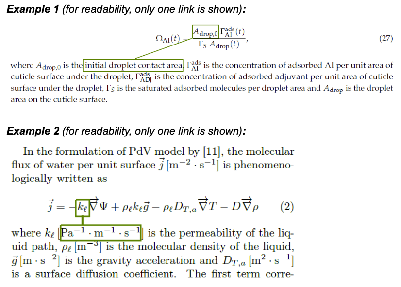

## Linking

### General Linking Problem

A very important part of the AutoMATES architecture is the process for *grounding* code identifiers (e.g., variables) and equation terms to scientific concepts expressed in text. Ideally, identifiers, equation terms and concepts expressed in text are eventually linked to domain ontologies. However, there is great value in linking these elements even if they cannot be grounded to an existing ontology. We conceptualize the grounding task as the assembly of a network of hypothesized association links between these elements, where each link expresses the hypothesis that the linked elements are about the same concept. 

This phase we further explored our conception of the overall grounding task, in terms of the types of links between information source elements, and this is summarized in the figure.

There are four types of information source element types, coming from two sources:

* Source code, which include
	* Code Identifiers
	* Code Comments
* Documents, which include
	* Document text
	* Equations

Code comments and document text in turn express at least three kinds of information:

* Descriptions (defintiions): associating a term with an expression, definition or definition of a concept.
* Units: associating the scale or units of a quantity.
* Parameter setting: expressing value constraints or specific values associated with a quantity.

Each link between source element types is made by a different inference process that depends on the information available in the sources.

* Link type 1 involves associating equations and their component terms to concepts in text. The start of our approach to identifying these links is described in the next section.
* Link type 2 involves associating code identifiers with concepts expressed in source code comments. In this phase, we infer these links by identifying mentions of the identifier names in source code text. In the future we will also make use of proximity of comments to locations in code as well as code scope to additionally support identifier-to-comment associations.
* Link type 3 involves associating code comment and document text. This linking inference is performed using a similarity score based on text embedding distance. 
* Link types 4, 5 and 6 are mapped out here, but we do not yet provide inference methods for these.
* Link types 7 and 8 involve mapping textual mentions of concepts to terms in one or more domain ontologies. We are working with Galois to demonstrate this in the September demo. The core approach will likely be an embedding similarity scoring, similar to the approach to Link type 3.

### Text and Equation Linking

The team is working to not only extract variables from equations, but also to link them to the in-text variables as well as the source code variables.  In order to evaluate the performance of the former, the team has begun creating an evaluation dataset. 
The specific task the team is looking to evaluate is linking the equation variables to their in-text definitions (ex. 1) and, when present, the associated units (ex. 2).

This effort will include the following steps:
- (in progress) collecting the documents to annotate: currently, the team is working on creating a set of heuristics to select the documents most suitable for the annotation exercise;
- (in progress) creating the annotation guidelines: the team is going through an iterative process of testing the guidelines on a small number of annotators and adjusting the guidelines based on the quality of elicited annotations, the level of agreement between the annotators, and the annotators’ feedback;
- annotating the documents;
- calculating the inter-annotator agreement score as a measure of quality of the created dataset.

Once completed, the team will use the collected dataset to evaluate linking techniques.

