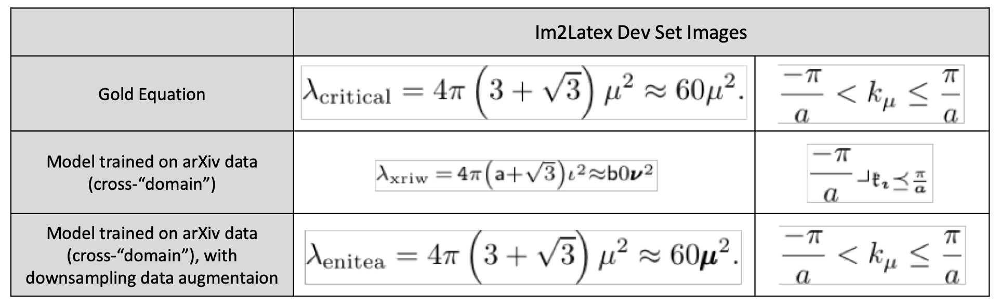

## Equation Reading

Since the models trained on a given image type (e.g., from the Image2Markup dataset (Deng, Kanervisto & Rush, 2016) or ours extracted from arXiv) were generalizing poorly to _other_ image types, what we loosely refer to here as cross-"domain", we analyzed the source of the errors.  Rather than being primarily due to font selection or font type, in this case, the problems arose largely from differences in the amount of downsampling.  To address this, the team incorporated a large-scale data-augmentation, randomly augmenting the arxiv images with different types and amounts of downsampling.  As a result, the model trained on the arXiv equations with downsampling showed a marked improvement when evaluated on the other image type (Image2Markup dataset), as shown with the example below.

Quantitatively, this result can be expressed in terms of BLEU score (Papineni et al., 2002), a measure developed for machine translation based on the overlap of bigrams.  
While this score is not perfect, it does provide a way to gauge model improvements. 
When we trained the model on our arXiv data, but evaluated on the Image2Markup validation data, we had a BLEU score of 13.0. 
However, the model which was trained on the arXiv data, but which additionally trained on the downsampled data (the data augmentation mentioned above), 
the resulting BLEU score was a much improved 45.5 (higher is better).

