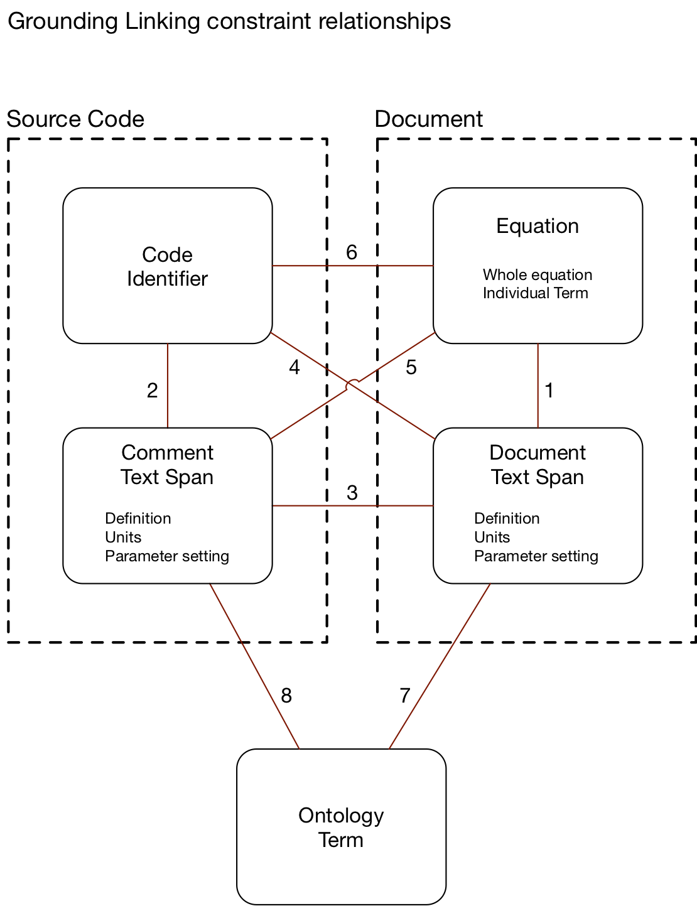

## Linking

### Approach updates

The team has been working on grounding the information coming from two sources (code and the associated documents describing the code in natural language and mathematical equations) by linking the four element types---code identifiers, code comments, document text, document equations (shown here). 

Currently, the following elements are linked:

- (Document) equation -> document text span (Link type 1):
	- This link requires a two step approach: linking the in-text variable to its description (previously implemented) and linking the variables in the equation to the associated in-text variables (prototyped).
- Source code identifier -> comment text span (Link type 2): 
	- the variable comments in DSSAT typically follow a specific format of the variable (verbatim) followed by the description.  We currently take advantage of this, and use Levenstein (string edit) distance, for now.
- Source code comment text span -> document text span (Link type 3):
	- We link the elements using a score which combines the Levenshtein distance and text word embedding distance, and filter out the link hypotheses with the score below a threshold.

### Evaluation Update (Annotation exercise):

The team has been working on creating the evaluation set for the linking task. So far, the team has gone through two rounds of preliminary small-set annotation, with the purpose of refining the annotation schema and the instructions. By exposing the team to more data and the annotation tool, the process has helped us make the following decisions:
- define what constitutes a variable for the purposes of text reading component of the pipeline
- define what information associated with the variable we want to extract from text and select a more appropriate label for that type of information (description vs. definition)
narrow down the scope of documents to include in the evaluation dataset using a set of heuristics (number of equations in a document, presence of other equations in the context of the equation, number of variables in the equation, etc.)

A minimum of one additional preliminary annotation round is required to refine the guidelines, and we’re considering ways to reduce the amount of time needed to annotate. Several decisions (e.g, annotation of constants and coreferenced descriptions) have been postponed until more data is seen.

