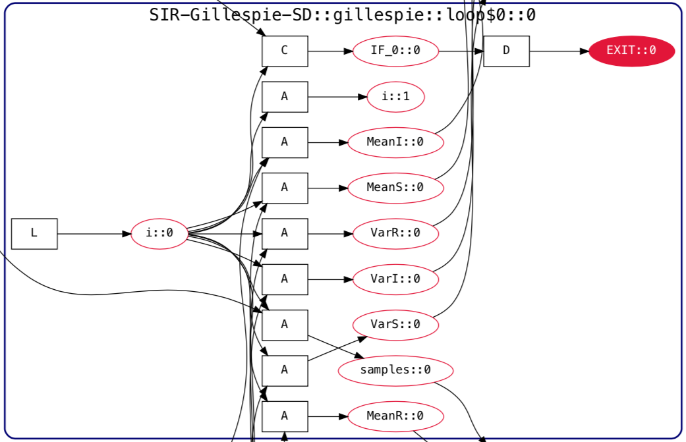
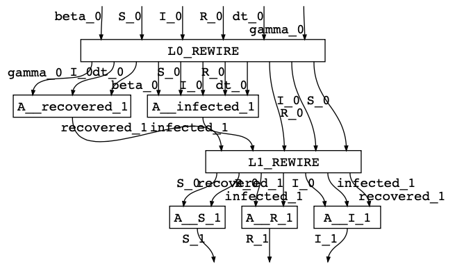

## Model Analysis
The MA team has been working closely with the PA team since our last report to update the creation and handling of GrFNs to support the AutoMATES collaboration with the GTRI and Galois teams for our joint demo. The members of the collaboration have all chosen to work with the `SIR` model family of infectious diseases. The majority of the updates in this report are extensions and revisions to the creation of GrFN computation graphs for the `SIR` model family. In addition we also present a new translation service, `GrFN2WD`, which handles the translation of GrFNs in `WiringDiagrams`, a construct used by the `GTRI` team to represent knowledge graphs in `SemanticModels.jl`.

<!--
TODO Souratosh (S), Paul (P) -  Updates on the following:
* S: Current status of dReal and Ibex experimentation and interval contraction approach
* S: other updates?
-->

### Updates to GrFN Wiring and Execution
In this section of the report we introduce updates to the GrFN CG generation and execution that are necessary to support the Gillespie SIR model (provided to the AutoMATES team by the Galois team). The GrFN CG view of this model is shown below. In order to represent the Gillespie SIR model as a GrFN CG, we needed to expand our language feature and program behavior coverage. Specifically we needed to add support for generalized loops, allow for multiple calls to the same container, and began creating program transformations to separate scientific models from their surrounding solver code. These three improvements are discussed in the following subsections.


#### Generalizing Loop Semantics and Execution
Previously, GrFN CGs have been able to represent loops that include an explicit index variable. This representation was done by marking the index variable and clearly recording the number of loop iterations. However, loops in many programs are far more varied. Not only do we see _open ended loops_ in source code, but we can also see statements inside a loop that affect the flow of data under the loop. In most programming languages these statements are `break`, `continue`, and a nested `return` call. These statements affect the flow of data as well as signal when to end the processing of a looping container. We handle the affect of these statements on data using `decision` function nodes the same way we handle `if` statements. For instance, analysis on an `if... <cond> ... continue` statement reveals that we can transform the data assignments after the statement into an `if not <cond> ... else` where all statements following the original `continue` are placed under the `else`. The same is true for a `break` statement but with the added complexity of a change in loop execution control.

In order to handle the loop execution impacts of a `break` or nested `return` statement, we have generalized our loop containers such that continuous execution is controlled by a boolean node labeled `EXIT`. The evaluation `EXIT` during execution will allow our GrFN CG execution scheme to determine if another round of execution is warranted for a loop. An example of a generalized loop with an `EXIT` statement from the Gillespie SIR model has been reproduced below. We distinguish `EXIT` nodes from regular variable nodes in a GrFN CG using a bright red node coloring.



#### Multi-call Container Semantics
In the Fortran version of the Gillespie SIR model we found a subroutine, `update_mean_var`, that was called multiple times during the programs execution. This is not unexpected as one key role of subroutines is to package reusable code to avoid code duplication. What we discovered when representing this program behavior in GrFN is that subroutines purposed for reducing code duplication create a strange phenomena in a graph-based representation where a single set of nodes is created for the subroutine and the input/output pairs from **all** calls to the subroutine connect directly to those nodes. This reduces readability and reduces the user to guessing which inputs align with the proper outputs. To avoid this issue we created a Container Call Uniqueness Index (CCUI) that allows us to differentiate separate calls to the same container and creates a different subgraph structure in the GrFN for each call. A portion of the Gillespie SIR model that includes three separate calls to the `update_mean_var` subroutine is shown below. The CCUI can be seen at the end of the label for the containers, and we can see in the graphic that the CCUI increase as the call number of the subroutine increases. Using this view we can easily separate the output from each call. Distinguishing these outputs allows us to see that this subroutine is used three times, once to update the mean value of `S`, then to update then mean value of `I`, and once more for `R`.


#### Dataflow Program Transformations
As mentioned in the MA introduction, much of our work since the last report has been to support our collaboration with the GTRI and Galois teams. Both of these teams request that we perform program transformations upon the original scientific source code ingested in our pipeline to separate the scientific model from surrounding code. In the case of the Gillespie SIR model, this surrounding code happens to be a solver for the model. In order to facilitate this request the MA team built the functionality to separate a GrFN into a model/solver form, given information obtained during grounding/linking from the text-reading and equation-reading teams. Below we show a GrFN CAG view of the Gillespie SIR model that demonstrates our ability to perform the program transformations necessary to separate the source code into model/solver components.


### Translating GrFN to WiringDiagrams for SemanticModels.jl
```Fortran
subroutine sir(S, I, R, beta, gamma, dt)
  implicit none
  double precision S, I, R, beta, gamma, dt
  double precision infected, recovered

  infected = (-(beta*S*I) / (S + I + R)) * dt
  recovered = (gamma*I) * dt

  S = S - infected
  I = I + infected - recovered
  R = R + recovered
end subroutine sir
```


```julia
using Catlab
using Catlab.WiringDiagrams
using Catlab.Doctrines
import Catlab.Doctrines: ⊗, id
import Base: ∘
include("SIR-simple__functions.jl")
⊗(a::WiringDiagram, b::WiringDiagram) = otimes(a, b)
∘(a::WiringDiagram, b::WiringDiagram) = compose(b, a)
⊚(a,b) = b ∘ a

beta_0, S_0, I_0, R_0, dt_0, gamma_0 = Ob(FreeSymmetricMonoidalCategory, :beta_0, :S_0, :I_0, :R_0, :dt_0, :gamma_0)
recovered_1, infected_1 = Ob(FreeSymmetricMonoidalCategory, :recovered_1, :infected_1)
S_1, R_1, I_1 = Ob(FreeSymmetricMonoidalCategory, :S_1, :R_1, :I_1)

id_I_0 = id(Ports([I_0]))
id_R_0 = id(Ports([R_0]))
id_S_0 = id(Ports([S_0]))

IN_1 = WiringDiagram(Hom(:L0_REWIRE, beta_0 ⊗ S_0 ⊗ I_0 ⊗ R_0 ⊗ dt_0 ⊗ gamma_0, gamma_0 ⊗ I_0 ⊗ dt_0 ⊗ beta_0 ⊗ S_0 ⊗ I_0 ⊗ R_0 ⊗ dt_0 ⊗ I_0 ⊗ R_0 ⊗ S_0))
WD_infected_1 = WiringDiagram(Hom(A__infected_1, beta_0 ⊗ S_0 ⊗ I_0 ⊗ R_0 ⊗ dt_0, infected_1))
WD_recovered_1 = WiringDiagram(Hom(A__recovered_1, gamma_0 ⊗ I_0 ⊗ dt_0, recovered_1))
OUT_1 = IN_1 ⊚ (WD_recovered_1 ⊗ WD_infected_1 ⊗ id_I_0 ⊗ id_R_0 ⊗ id_S_0)

IN_1 = WiringDiagram(Hom(:L1_REWIRE, recovered_1 ⊗ infected_1 ⊗ I_0 ⊗ R_0 ⊗ S_0, S_0 ⊗ infected_1 ⊗ R_0 ⊗ recovered_1 ⊗ I_0 ⊗ infected_1 ⊗ recovered_1))
WD_I_1 = WiringDiagram(Hom(A__I_1, I_0 ⊗ infected_1 ⊗ recovered_1, I_1))
WD_R_1 = WiringDiagram(Hom(A__R_1, R_0 ⊗ recovered_1, R_1))
WD_S_1 = WiringDiagram(Hom(A__S_1, S_0 ⊗ infected_1, S_1))
OUT_2 = OUT_1 ⊚ IN_1 ⊚ (WD_S_1 ⊗ WD_R_1 ⊗ WD_I_1)
```


### Domain Constraint Propagation
The task of domain constraint propagation, introduced in previous reports, has been placed on hold while we work on completing the necessary components of the AutoMATES pipeline to facilitate our collaboration with the GTRI and Galois teams.
