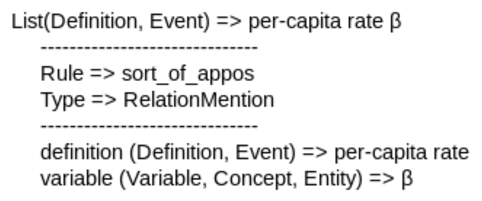

## Text Reading

The team has been working on improving extraction of variables and descriptions from text:
- adjusting the comment reader to read the comments from the grfn json, where they are now stored; this has allowed us to automate comment extraction and provide the more detailed information for the source of each comment to include in the comment link element (e.g., the container);
- including a Greek letter lexicon to make sure Greek letters are found as variable by the entity finder:

- updating rules to improve precision;
- extracting variables and their descriptions from the text of the abstract of the document in addition to the sections;
- modifying expansion handler to only expand certain types of arguments; currently, we only want to expand descriptions to make sure modifiers are included as that makes for more complete descriptions; variables, on the other hand, are frequently one or two word entities and expanding those results in a number of false positives.

