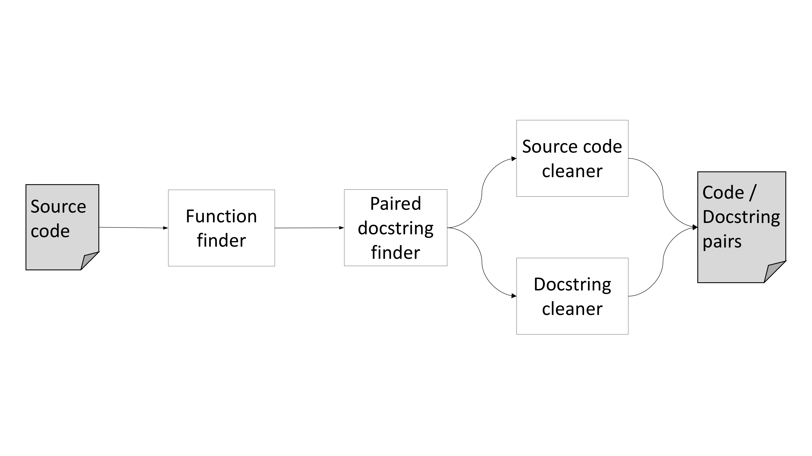

## Code Summarization
So far our experiments in code summarization have focused on the ability to generate natural language descriptions of source code functions using state-of-the-art neural models, namely a `Sequence2Sequence` neural machine translation (NMT) model. Our `Sequence2Sequence` model of choice is the global attention encoder-decoder described in [_Effective Approaches to Attention-based Neural Machine Translation_](https://arxiv.org/pdf/1508.04025.pdf). As we will discuss in the next sections our neural models have failed to perform at the end-goal task of generating descriptions for source code. We will review the experiments we have run to come to this conclusion and discuss the shortcomings of our neural methods in the following sections. In the final section we will discuss our alternative methods for generating source code function descriptions for the lambda fucntions generated by the AutoMATES pipeline.

#### Dataset overview
To begin our experiments we needed to create a corpus of source code function / docstring pairs from the Python programming language. This decision was made because our end goal was to create a model that would generate docstring-like descriptions for our lambda functions that are being output in Python. Training a neural model to accomplish this task requires large amounts of data. Therefore we chose to index the entirety of the [awesome-python](https://awesome-python.com) list of python packages for any source code functions that also contained a docstring. In order to locate and control the quality of the source code / docstring pairs we created a tool called `CodeCrawler`. The pipeline for `CodeCrawler` is shown in the graphic below and explained in the following section.


- **Function finder**: This component utilized Python's builtin `inspect` module to find all function signatures in a Python module. The `inspect` module also has the ability to grab the docstring associated with a function using the `__doc__` variable.
- **Paired docstring finder**: This component determined whether the docstring returned from the `__doc__` attribute qualified as a descriptive function comment. To do this, we checked the docstring to see if it conformed to the [PEP 257](https://www.python.org/dev/peps/pep-0257/) standards for docstrings. If the docstring conformed to the formatting standards then we used the function description section as our descriptive docstring.
- **Source code cleaner**: After identifying a function for our corpus this component cleaned the function code to lower the amount of unique tokens in the code by doing the following:
  - All identifiers were split based on `snake_case` and `camelCase` rules.
  - All numbers were separated into digits
  - All string literals were replaced with the token `<STRING>`
- **Docstring cleaner**: Our docstring cleaner was responsible for removing all parts of the docstring that were not specified as descriptive by the PEP 257 standards. This was accomplished with simple pattern matching on the docstring.

Using `CodeCrawler` we found a total of `76686` Python functions with well-formed docstrings.

#### Experimental results
After creating our corpus we proceeded to test it's abilities on a classification task. Our classification task was to see whether a network, with the same architecture as a `Sequence2Sequence` translation model, could identify whether a given source code function and docstring were correctly paired. We formed two classification datasets to study our performance on this task. From our corpus described above we had `76686` positive association examples. To get examples of negative association for our first dataset we randomly sampled docstrings from our corpus to form a negative match for each function in our corpus. The combination of these negative examples with our positive examples formed a dataset named the `random-draw` dataset. For our second dataset we selected examples of negative association using a lucene index over the docstrings. For a particular function we selected its negative associated docstring to be the docstring with highest lexical overlap to the true docstring. The combination of these negative examples with our positive examples formed a dataset named the challenge dataset. After performing a grid search over the hyperparameters of our architecture we were able to get the following classification results for our dataset summarized in the table below.

| Dataset | Accuracy | Precision | Recall | F1 |
| :---: | ---: | ---: | ---: | ---: |
| `random-draw` | 89% | 48% | 82% | 60% |
| `challenge` | 64% | 14% | 61% | 23% |

While our random-draw dataset had high accuracy, the low precision score for randomly chosen code/docstring pairs was immediately concerning. The loss in performance when classifying on the challenge dataset also became a concern for our neural model, especially since the precision score decreased by a larger amount than the recall score. This indicates that as the classification problem becomes harder it becomes easier for the model to mistakenly classify a mismatched docstring as the true docstring for a function. This was our first indication that the docstrings in our corpus may lack the signal necessary to distinguish a source code function from another, something that would be crucial for creating a useful description of a source code function.

Our final experiment with our neural model was to test its generation capabilities. We trained our generative model on our initial corpus of code/docstring pairs with part of our corpus as a development set to allow us to optimize the models hyperparameters. We then tested our generators ability to translate unseen source code functions into a descriptive summarized docstring. The `BLEU-4` score obtained by our method was `1.88`, which is far lower than the `BLEU-4` scores obtained in many code summarization tasks. We will discuss the quality of our generation performance in the corpus quality discussion section.

#### Experimental data and scripts
The data necessary to replicate our experiments can downloaded using the following command:
```
curl -O http://vision.cs.arizona.edu/adarsh/automates/code-summ-corpus.zip
```
You must then unzip the file to expose the contained folder `code-summ-corpus/`. After unzipping the file, the following environment variable needs to be defined before running any of our mentioned tools:
```
export CODE_CORPUS="/path/to/code-summ-corpus"
```
All of our tools require these Python modules: `numpy, torch, torchtext, tqdm`
These can all easily be installed in a python virtualenv using `pip` or `conda`.

###### Running the CodeCrawler tool
To run the `CodeCrawler` tool you will need to install `nltk` to the same environment as the other packages defined above. The `CodeCrawler` tool can be run using this command:
```
python automates/code_summarization/code-crawler/main.py
```

###### Running the classification experiments
The classification experiments can be run with the following command:
```
python automates/code_summarization/src/main.py [-e <amt>] [-b <amt>] [-c <name>] [-g] [-d] [-t]
```
The flags associated with this command are:
- `-e`: The number of epochs to train the model. Increasing the number of epochs will increase the training time, but result in higher accuracy.
- `-b`: The size of a batch for training and testing. Larger batch sizes decrease the training time for a model, but can decrease accuracy.
- `-c`: The classification corpus to use, either `rand_draw` or `challenge`
- `-g`: GPU availability. Include this flag if your system has an Nvidia GPU
- `-d`: Development set evaluation. Include this flag to evaluate the model on the development set.
- `-t`: Test set evaluation. Include this flag to evaluate the model on the test set.

In addition to running the code, our pre-computed results can be observed by running:
```
python automates/code_summarization/src/scripts/dataset_scores.py <score-file>
```
where `score-file` is one of the pickle files stored at `/path/to/code-summ-corpus/results/`.

###### Running the generation experiment
The generation experiment can be run with the following command:
```
python automates/code_summarization/src/generation.py [-e <amt>] [-b <amt> [-g] [-d] [-t]
```
All of the flags mentioned in the command above have the same definitions as the commands outlined in the above section dealing with our classification experiments.

Our generation results can also be verified using our pre-computed results with the following script:
```
python automates/code_summarization/src/utils/bleu.py <truth-file> <trans-file>
```
where `truth-file` and `trans-file` are text files located at stored at `/path/to/code-summ-corpus/results/`. Note that the two files should have the same prefix, the `truth-file` should end with `_truth.txt`, and `trans-file` should end with `_trans.txt`.


#### Corpus quality discussion
After observing the results discussed in the sections above for our classification and generation experiments we decided to manually inspect our corpus of code/docstring pairs. To do this, we randomly sampled a set of 100 code/docstring pairs for evaluation. All of the examples shown below that will be used to make conjectures about our code/docstring corpus were taken from this random sampling.

Our end-goal for this corpus is for the functions it contains to emulate the content of functions we expect to see in our generated lambda functions, and for the docstrings associated with the functions to be descriptive of the code  in the function. Below are two examples from our corpus that do meet these standards. The docstrings are descriptive of the actual code in the functions and the identifiers in the functions can be used to deduce the proper docstrings.
```python
def __ne__(self, other):
    """Returns true if both objects are not equal"""
    return not self == other

def printSchema(self):
    """Prints out the schema in the tree format."""
    print(self._jdf.schema().treeString())
```

Unfortunately many of the functions found in our corpus included associative docstrings as opposed to descriptive docstrings. By associative docstring we mean that the portion of the dosctring that we are recovering, which is intended to be descriptive by PEP 257 standards, merely associates the function either with some other module level construct or some real-world phenomena.
```python
def __repr__(self):
    """For `print` and `pprint`"""
    return self.to_str()

def get_A1_hom(s, scalarKP=False):
    """Builds A1 for the spatial error GM estimation
    with homoscedasticity as in Drukker et al."""
    n = float(s.shape[0])
    wpw = s.T * s
    twpw = np.sum(wpw.diagonal())
    e = SP.eye(n, n, format='csr')
    e.data = np.ones(int(n)) * (twpw / n)
    num = wpw - e
    if not scalarKP:
        return num
    else:
        den = 1. + (twpw / n) ** 2.
        return num / den

def is_hom(self, allele=None):
    """Find genotype calls that are homozygous."""

    if allele is None:
        allele1 = self.values[..., 0, np.newaxis]
        other_alleles = self.values[..., 1:]
        tmp = (allele1 >= 0) & (allele1 == other_alleles)
        out = np.all(tmp, axis=-1)
    else:
        out = np.all(self.values == allele, axis=-1)

    if self.mask is not None:
        out &= ~self.mask

    return out
```

Module level dependency information
```python
def sparseDfToCsc(self, df):
    """convert a pandas sparse dataframe to a scipy sparse array"""
    columns = df.columns
    dat, rows = map(list, zip(
        *[(df[col].sp_values - df[col].fill_value, df[col].sp_index.to_int_index().indices) for col in columns]))
    cols = [np.ones_like(a) * i for (i, a) in enumerate(dat)]
    datF, rowsF, colsF = np.concatenate(dat), np.concatenate(rows), np.concatenate(cols)
    arr = sparse.coo_matrix((datF, (rowsF, colsF)), df.shape, dtype=np.float64)
    return arr.tocsc()

def getArrayRegion(self, data, img, axes=(0,1), order=1, **kwds):
    """Use the position of this ROI relative to an imageItem to pull a slice
    from an array."""

    imgPts = [self.mapToItem(img, h['item'].pos()) for h in self.handles]
    rgns = []
    for i in range(len(imgPts)-1):
        d = Point(imgPts[i+1] - imgPts[i])
        o = Point(imgPts[i])
        r = fn.affineSlice(data, shape=(int(d.length()),), vectors=[Point(d.norm())], origin=o, axes=axes, order=order, **kwds)
        rgns.append(r)

    return np.concatenate(rgns, axis=axes[0])
```
