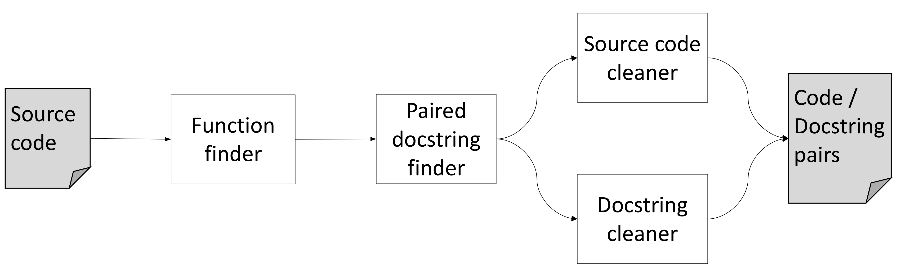

## Code Summarization

The goal of the Code Summarization module is to provide one or more methods to automatically generate natural language descriptions of components of source code. Work in Phase 1 has been devoted to evaluating some of the state of the art `Sequence2Sequence` neural machine translation (NMT) model described in [_Effective Approaches to Attention-based Neural Machine Translation_](https://arxiv.org/pdf/1508.04025.pdf), a kind of Bi-LSTM inspired by machine translation methods that map sequences in one language to another. In the [Month 3 Report on Code Summarization](https://ml4ai.github.io/automates/documentation/deliverable_reports/m3_report_prototype_system/#code-summarization) we presented the initial empirical results of training the NMT model on a training/evaluation corpus we developed, starting with training the code and language embedding models (the initial encodings of the source and target domains) and then evaluating the capacity of the embeddings to perform a simpler "relevant/not-relevant" document classification task. Since the Month 3 report. we have continued evaluating the model and here summarize lessons learned so far. Relatively low performance has led us to consider alternative approaches to code summarization. In this section we review the experiments we have performed and discuss the limitations of the current neural methods. In the final section, we will discuss our proposed alternative strategy for code summarization.

### Dataset overview

NMT requires a significant amount of training data. We extracted a very large corpus of Python function-docstring pairs by scraping the entirety of the [awesome-python](https://awesome-python.com) list of Python packages, extracting function source code and their associated docstrings.
In order to locate and control the quality of the source code / docstring pairs we extract, we created a tool called CodeCrawler. The processing pipeline for CodeCrawler is shown in Figure 22.



**Figure 22:** Code Crawler architecture.

- **Function finder**: This component uses Python's built-in `inspect` module to find all function signatures in a Python module. The `inspect` module also has the ability to grab the docstring associated with a function using the `__doc__` variable.

- **Paired docstring finder**: This component determines whether the docstring returned from the `__doc__` attribute qualifies as a descriptive function comment. To do this, we check the docstring to see if it conforms to the [PEP 257](https://www.python.org/dev/peps/pep-0257/) standards for docstrings. If the docstring conforms, we then use the function description section as our descriptive docstring.

- **Source code cleaner**: Code summarization methods generally try to learn how to map from source code vocabulary (what terms are used in code) to a natural language description. In general, this task is easier when the source code vocabulary is observed repeatedly under different conditions. In order to reduce the number of unique source code vocabulary terms (and thereby increase the frequency with which each term is observerd), this component "cleans" the function code by the following rules:
  - All identifiers are split based on `snake_case` and `camelCase` rules.
  - All numbers are separated into digits (e.g., 103 becomes 1, 0, 3).
  - All string literals were replaced with the token `<STRING>`.

- **Docstring cleaner**: Following the same intuition as the source code cleaner, the docstring cleaner is responsible for removing all parts of the docstring that are not specified as descriptive, according to PEP 257 standards. This is accomplished with simple pattern matching on the docstring.

Using CodeCrawler, we found a total of 76686 Python functions with well-formed docstrings.

### Experimental results

In the [Month 3 Report on Code Summarization](https://ml4ai.github.io/automates/documentation/deliverable_reports/m3_report_prototype_system/#code-summarization), we presented the initial results of training and evaluating the embedding layer to the NMT model using the corpus extracted by the CodeCrawler. To evaluate whether the trained embeddings appear to be capturing information about the relationship of source code features to natural language summaries, we first created a simple classification task that evaluates the ability of the embeddings to inform a decision about whether a provided natural language description is "relevant" to input source code. 

As reported in the [Month 3 Report on Code Summarization](https://ml4ai.github.io/automates/documentation/deliverable_reports/m3_report_prototype_system/#code-summarization), we created two datasets from our corpus for this classification task. In both cases, we use the 76686 positive association examples found using CodeCrawler, but the differences are in how _negative_ funciton/docstring pairs are constructed:

- The first dataset, which we call the _random-draw_ dataset, for each source code function to be summarized, we uniformly randomly sampled a docstring from the corpus and associated it with the function.
- For the second, _challenge_, dataset, we used a Lucene index over the docstrings to then search for docstrings with the highest lexical overlap to the true docstring originally associated with the function. This classification task will be significantly more difficult as now the associated negative example shares much in common with the original description, but must still be distinguished. 

For both datasets, we generated the same number of negative examples as positive: 76686.

By the Month 3 report, we had only just constructed the two datasets and only havd very preliminary results for the _random-draw_ dataset. We completed this study, training the neural network model using both data sets, in both cases performing a grid search to optimize the hyperparameters. The results of the two models are summarized in the following table:

| Dataset       | Accuracy | Precision | Recall | F1   |
| :---         | ---:     | ---:      | ---:   | ---: |
| `random-draw` | 89%      | 48%       | 82%    | 60%  |
| `challenge`   | 64%      | 14%       | 61%    | 23%  |

The model achieves fairly high  accuracy on the _random-draw_ dataset, but this is likely a fairly easy baseline given that random code strings will very likely not be relevant to the code the function has been randomly paired with. The challenge data set, however, is much more difficult, as reflected in the results. Precision, in particular, takes a very big hit.

**TODO: Finish this explanation...**

Next, we evaluated the NMT model by training and evaluating the model on our overall corpus, using the [BLEU-4](https://en.wikipedia.org/wiki/BLEU) score as an estimate of how close the generated natural language summarization is to the original docsctring associated with the source code. Unfortunately, the BLEU-4 score is so far very low: 1.88, significantly lower than the reported SOA NMT of **TODO** -- although their results are on a much more restricted evaluation data set.

In the next section we discuss the lessons learned so far.

### Lessons and next steps

We manually inspected a randomly sampled subset of 100 code/docstring pairs from our corpus to better understand what might be limiting the current model's performance and identify how we might overcome these limits. Based on these samples, we now have a few conjectures about the nature our code/docstring corpus.

Our end-goal for this corpus is for the functions it contains to summarize the content of functions we expect to see in our generated lambda functions in generated docstrings that are descriptive of the code in the function.
Below are two examples from our corpus that do meet these standards. The
docstrings are descriptive of the actual code in the functions and the
identifiers in the functions can be used to deduce the proper docstrings.

```python
def __ne__(self, other):
    """Returns true if both objects are not equal"""
    return not self == other

def printSchema(self):
    """Prints out the schema in the tree format."""
    print(self._jdf.schema().treeString())
```

Unfortunately, many of the functions found in our corpus had associative,
rather than descriptive, docstrings, i.e. the portion of the dosctring that we are recovering, which is intended to be descriptive according to the PEP 257 standards, merely associates the function either with some other module level construct or some real-world phenomena. Some examples of such functions are included below.
It is easy to see how creating these docstrings would require outside context and cannot be recovered from the actual source code. While these functions may be ideal for a different task, they are not useful in our corpus, and are more numerous than we had expected.

```python
def __repr__(self):
    """For `print` and `pprint`"""
    return self.to_str()

def get_A1_hom(s, scalarKP=False):
    """Builds A1 for the spatial error GM estimation
    with homoscedasticity as in Drukker et al."""
    n = float(s.shape[0])
    wpw = s.T * s
    twpw = np.sum(wpw.diagonal())
    e = SP.eye(n, n, format='csr')
    e.data = np.ones(int(n)) * (twpw / n)
    num = wpw - e
    if not scalarKP:
        return num
    else:
        den = 1. + (twpw / n) ** 2.
        return num / den

def is_hom(self, allele=None):
    """Find genotype calls that are homozygous."""

    if allele is None:
        allele1 = self.values[..., 0, np.newaxis]
        other_alleles = self.values[..., 1:]
        tmp = (allele1 >= 0) & (allele1 == other_alleles)
        out = np.all(tmp, axis=-1)
    else:
        out = np.all(self.values == allele, axis=-1)

    if self.mask is not None:
        out &= ~self.mask

    return out
```

We have identified a second class of problematic functions in our corpus, that have docstrings that are descriptive, but composed mainly of references to items created in the module hierarchy of the Python module that the function resides in.
This presents two challenges for docstring generation.
First, it is expected to include information when generating the description of a function that is not contained in the function.
This is ilustrated in the first of the two examples below, where a
docstring includes references to the `pandas` and `scipy` libraries.
Such information would never be included in the source code of a Python function.
The second challenge for docstring generation is in dealing with module level information.
Python is an object-oriented language, and thus functions written
in Python deal with objects, and it is expected that programmers inspecting and utilizing the functions will be aware of those objects.
This is additional information outside of the actual function itself that our docstring generator will not have access to, and a perfect example of this is shown as the second example below, where the `Point` and `imageItem` class are both objects at the module level that are referenced by the function.

```python
def sparseDfToCsc(self, df):
    """convert a pandas sparse dataframe to a scipy sparse array"""
    columns = df.columns
    dat, rows = map(list, zip(
        *[(df[col].sp_values - df[col].fill_value, df[col].sp_index.to_int_index().indices) for col in columns]))
    cols = [np.ones_like(a) * i for (i, a) in enumerate(dat)]
    datF, rowsF, colsF = np.concatenate(dat), np.concatenate(rows), np.concatenate(cols)
    arr = sparse.coo_matrix((datF, (rowsF, colsF)), df.shape, dtype=np.float64)
    return arr.tocsc()

def getArrayRegion(self, data, img, axes=(0,1), order=1, **kwds):
    """Use the position of this ROI relative to an imageItem to pull a slice
    from an array."""

    imgPts = [self.mapToItem(img, h['item'].pos()) for h in self.handles]
    rgns = []
    for i in range(len(imgPts)-1):
        d = Point(imgPts[i+1] - imgPts[i])
        o = Point(imgPts[i])
        r = fn.affineSlice(data, shape=(int(d.length()),), vectors=[Point(d.norm())], origin=o, axes=axes, order=order, **kwds)
        rgns.append(r)

    return np.concatenate(rgns, axis=axes[0])
```

#### Alternative strategy for code summarization

In summary, we found that most of the code/docstring pairs were non-atomic,
meaning that docstrings paired with the code relied upon at least one form of additional information in order to be formed. For our purposes, we desire atomic functions, whose docstrings could be generated without any additional information.  Our lambda functions generated by the AutoMATES pipeline certainly fit this definition, and thus our code/docstring corpus is not a good model for our target generation task.  This realization has encouraged us to abandon the use of the code/docstring corpus as training data for our docstring generation method. Unfortunately this restricts our generation methods due to the lack of available data. Without a sufficiently sized amount of data `Sequence2Sequence` models cannot perform well at generation tasks. Therefore our new strategy for code summarization will be to investigate rule-based methods for generating function descriptions.  We are confident that rules can take advantage of the highly structured, simplistic, and atomic nature of our generated lambda functions in order to create descriptions of each lambda function that can then be pieced together to form larger descriptions of the original subroutines.

### Acquiring the corpus and running the training scripts

The data necessary to replicate our experiments can be downloaded using the
following commands (for *nix systems):

```
curl -O http://vision.cs.arizona.edu/adarsh/automates/code-summ-corpus.zip
```

Unzip the file to expose the contained folder `code-summ-corpus/`, and then set the `CODE_CORPUS` environment variable to point to the data folder:

```
export CODE_CORPUS="/path/to/code-summ-corpus"
```

The code summarization tools require the following Python modules: `numpy`, `torch`, `torchtext`, and `tqdm`. These can all easily be installed using `pip` or `conda`.

##### Running the CodeCrawler tool

To run `CodeCrawler`, you will need to install `nltk` as well. The
`CodeCrawler` tool can be run using this command (assuming you have cloned the automates Github repo):

```
python automates/code_summarization/code-crawler/main.py
```

##### Running the classification experiment scripts

The classification experiments can be run with the following command:

```
python automates/code_summarization/src/main.py [-e <amt>] [-b <amt>] [-c <name>] [-g] [-d] [-t]
```

The flags associated with this command are:

- `-e`: The number of epochs to train the model. Increasing the number of
  epochs will increase the training time, but result in higher accuracy.
- `-b`: The size of a batch for training and testing. Larger batch sizes
  decrease the training time for a model, but can decrease accuracy.
- `-c`: The classification corpus to use, either `rand_draw` or `challenge`
- `-g`: GPU availability. Include this flag if your system has an Nvidia GPU
- `-d`: Development set evaluation. Include this flag to evaluate the model on
  the development set.
- `-t`: Test set evaluation. Include this flag to evaluate the model on the
  test set.

In addition to running the code, our pre-computed results can be observed by running:

```
python automates/code_summarization/src/scripts/dataset_scores.py <score-file>
```

where `score-file` is one of the pickle files stored at
`/path/to/code-summ-corpus/results/`.

##### Running the summary generation experiment

The natural language summary generation experiment can be run with the following command:

```
python automates/code_summarization/src/generation.py [-e <amt>] [-b <amt> [-g] [-d] [-t]
```

All of the flags mentioned in the command above have the same definitions as the commands outlined in the above section dealing with our classification experiments.

Our generation results can also be verified using our pre-computed results with the following script:

```
python automates/code_summarization/src/utils/bleu.py <truth-file> <trans-file>
```

where `truth-file` and `trans-file` are text files located at stored at
`/path/to/code-summ-corpus/results/`. Note that the two files should have the same prefix, the `truth-file` should end with `_truth.txt`, and `trans-file` should end with `_trans.txt`.
