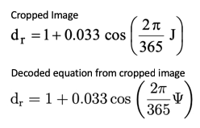
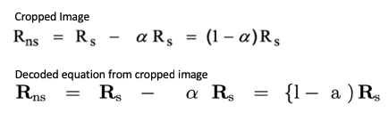
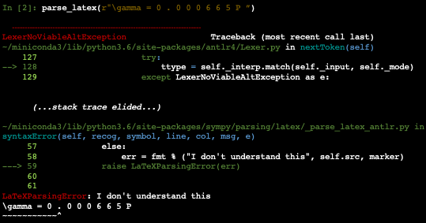
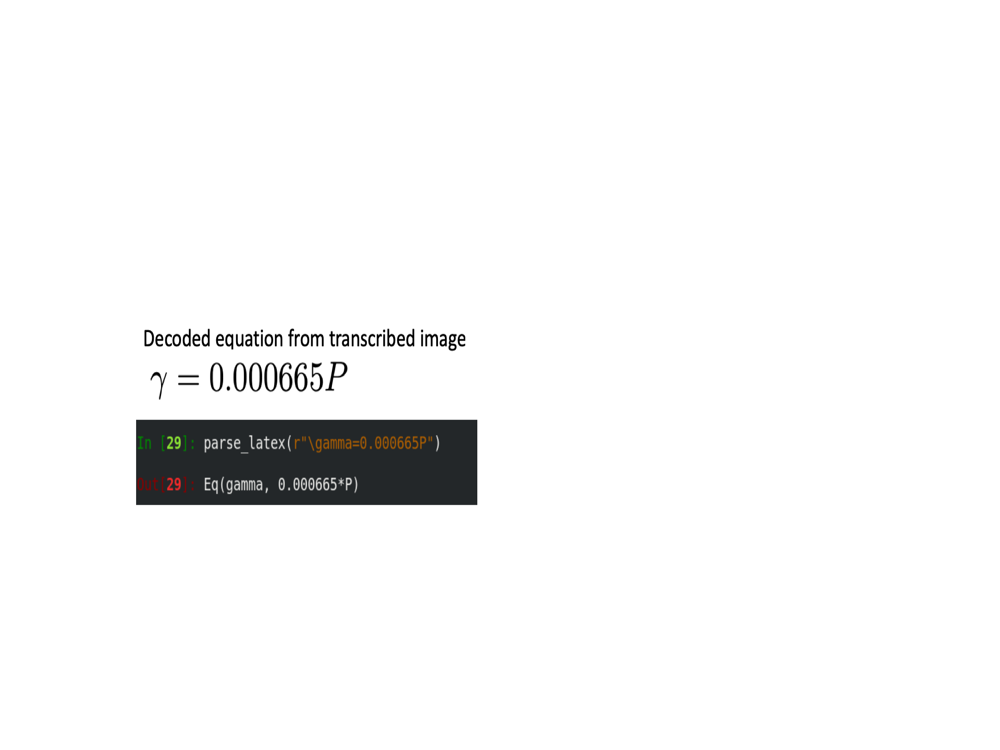
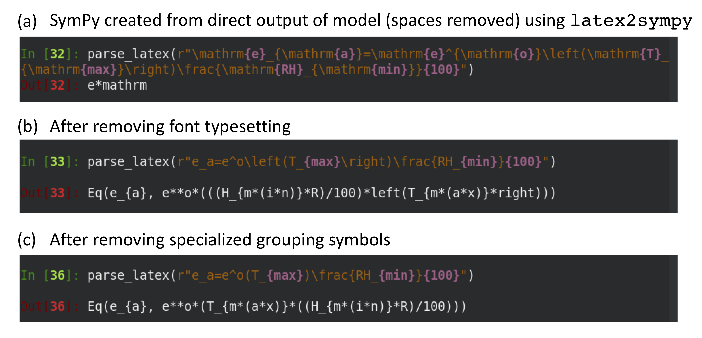

## Equation Detection and Parsing

Models are often represented concisely as equations, at a level of abstraction that can supplement
both the natural language description as well as the source code implementation. Accordingly, the AutoMATES team is implementing a module for automatically reading equations found in scientific papers. This section details the approaches for (a) data acquisition, (b) detecting the location of equations, (c) encoding the image of the equation and then decoding it into a formal representation, and (d) converting the formal representation into an executable one that can be used in program analysis. Here we discuss the current progress as well as the next steps. To make rapid progress, the team has extensively explored available state-of-the-art (SOA) open-source tools and resources, and so additionally we discuss the limitations of these tools as well as our plans for addressing these limitations.

All code for the Equation Reading pipeine is implemented within the AutoMATES
[equation_extraction](https://github.com/ml4ai/automates/tree/master/equation_extraction) repository directory. There is additionally a [section below](#Instructions-for-running-components) devoted to explaining the steps needed to run each component of the architecture.

### Architecture

**Figure**: The overall architecture for equation detection and reading.

In grey are the linkages that are planned, but not yet in place. The currently-used SOA open source components are indicated with striped fill. See the corresponding sections for the discovered limitations of these third-party components for our use case and our plans for replacing/extending each.

### Data collection

In order to train and evaluate the neural machine learning components used in the detection and decoding of equations found in text, several datasets needed to be constructed.

For this purpose, the team is making use of papers written in LaTeX (TeX), downloaded
in bulk from [arXiv](https://arxiv.org), an open-access preprint database for scientific publications. The team has downloaded the complete set of arXiv PDFs and their corresponding source files from Amazon S3 as described [here](https://arxiv.org/help/bulk_data_s3). Similar datasets have been constructed previously, but they are very limited in scope.
Most relevantly, a sample of source files from the `hep-th` (theoretical high-energy physics) section of arXiv was collected in 2003 for the [KDD cup competition](https://www.cs.cornell.edu/projects/kddcup/datasets.html) (see [equation decoding section](#Equation-decoding) for examples of the consequence of this limited scope). By downloading the full set of arXiv, the team has extended this dataset to both increase the number of training examples and to include a variety of relevant
domains (including agriculture, biology, and computer science).

#### Dataset preprocessing pipeline

The team has put together a preprocessing pipeline with the purpose of
preparing the downloaded arXiv data for use in equation detection and decoding.

First, the paper source files are organized consistently in a directory structure that can be processed efficiently. Then, for each paper, the TeX file that has the `\documentclass` directive is selected as the main
TeX file (see [here](https://arxiv.org/help/faq/mistakes#wrongtex) for more information). Once a main TeX file has been selected, the TeX source is
tokenized using [plasTeX](https://github.com/tiarno/plastex) and the content of certain environments are collected together with
the environment itself (e.g., the tokens inside the `\begin{equation}` and `\end{equation}` directives, together with the label `equation`). User-defined macros are expanded using code developed by the team, to normalize the input to the neural decoder.

Based on an analysis of 1600 arXiv papers, the most commonly used math environments (in order) are: `equation`, `align`, and `\[ \]`. While the team currently only handles the `equation` environment (40% of the equations found), the pipeline will be extended to accomodate the other two as well.

The extracted code for each equation is rendered into a standalone equation image. The paired standalone image and source tokens form the training data for the [equation decoder](#Equation-decoding). Additionally, the PDF file for the entire paper is scanned for the standalone equation image using [template matching](https://docs.opencv.org/4.0.0/df/dfb/group__imgproc__object.html). The resulting axis-aligned bounding box (AABB) is stored for the subsequent training of an [equation detector](#Equation-detection).

While much of the preprocessing pipeline is complete, there are a few remaining elements that need to be implemented. The team will work on additional normalization of the extracted TeX tokens to provide the equation decoder a more consistent input. At minimum, the this will include the removal of superfluous code such as`\label{}` directives, the normalization of certain LaTeX expressions
(e.g., arbitrary ordering of super and sub-scripts in equations), and the [augmentation of the rendered standalone equations](#Equation-decoding).

### Equation detection

<<<<<<< HEAD
Before equations can be decoded, they first need to be located within the scientific papers encoded as PDF files. For this, the team evaluated standard machine vision techniques. The SOA [Mask-RCNN](https://github.com/matterport/Mask_RCNN) (He et al., 2017) was selected both for its robust performance across several detection tasks as well as its ease of use. Here, as the desired output of the model is the page and AABB of the detected equations, we ignore the mask (i.e., the precise set of pixels which compose the object), and as such the model is essentially an easy to use Faster R-CNN (Ren et al., 2015).

The Faster R-CNN model uses a base network consisting of a series of convolutional and pooling layers as feature extractors for subsequent steps. This network is typically a [ResNet](https://arxiv.org/abs/1512.03385) backbone trained over [ImageNet](http://www.image-net.org/) or [COCO](http://cocodataset.org).

Next, a region proposal network (RPN) uses the features found in the previous step to propose a predefined number of bounding boxes that may contain equations. For this purpose, fixed bounding boxes of different sizes are placed throughout the image. Then the RPN predicts two values: the probability that the bounding box contains an object of interest, and a correction to the bounding box for it to better fit the object.

At this point, the Faster R-CNN uses a second step to classify the type of object, using a traditional R-CNN. Since here there is only one type of object of interest (equations), the output of the RPN can be used directly, simplifying training and speeding up inference. However, one potential disadvantage of only having a single label is that the model could be confused by similar page components (e.g., section titles and tables). Since we have access to the TeX source code, in the future we can include these other objects and their labels and will train the model to differentiate between them explicitly.

Currently, the team has been able to train the Mask-RCNN, on the equation images and AABBs from the arXiv data, however GPU-related constraints have temporarily limited progress.  As results become available, we will update this report with the corresponding timestamps.

### Equation decoding

Once detected, the rendered equations need to be automatically converted into LaTeX code. For this purpose, we employ an encoder-decoder architecture, which encodes the equation image into a dense embedding and subsequentially decodes it into LaTeX code capable of being compiled into an image. LaTeX was selected as the intermediary representation between image and executable model because of the availability of training data (arXiv) and because it preserves both typographic information about how equations are rendered (e.g., bolding, italics, subscript, etc.) while also preserving the components of the notation that will be used for the successful interpretation of the equation semantics.

Encoder-decoder architectures like the one proposed have been successfully applied in the past for the purpose of image caption generation (e.g., Vinyals et al., 2017). Here, to make rapid progress, we began with an existing SOA model previously trained for the purpose of converting images to markup (Deng et al., 2017). The model was trained with the [2003 KDD cup competition](http://www.cs.cornell.edu/projects/kddcup/datasets.html) sample of arXiv mentioned above.

We evaluated this pre-trained model for our use case on a sample of 20 domain-relevant equations from a scientific paper describing the ASCE evapotranspiration model (Walter et al., 2000). We provided the model with two versions of each equation. The first version of the equation conforms exactly to the model's training data. To achieve this, we were required to manually transcribe the equation into LaTeX, render it with the authors' exact template, convert the resulting PDF into a PNG file using a specific tool with specific resolution settings, and finally pass it through their pre-processing pipeline. We refer to this version of the equation image as the _transcribed_ version. This is clearly not scalable, as the entire purpose of this component is to avoid hand-transcribing equations into LaTeX, however, the model's results on these versions of the equations serve as a useful ceiling perfomance for the pre-trained model without updating.

The second version of the equation image is more representative of a real-world usage within the AutoMATES project. We took screenshots of the equations from the original paper that are cropped to the size of an AABB (as such, we refer to this version of the equation image as the _cropped_ version). We found that the pre-trained model was unable to handle these as initially created, and they needed to be rescaled to 50% of their original size. These images were then also passed through the authors' pre-processing pipeline.

When comparing the results of the model on the _transcribed_ and _cropped_ equation images, we found several patterns.

First, there are several cases in which the pre-trained model is able to correctly decode the _transcribed_ image (12 out of 20, or 60% of the images). This correct decoding accuracy drops to 5% when using the _cropped_ images (strictly speaking, it is 0%, but on one image the only mistake is superficial only). The proportion of character-level mistakes (e.g., wrong characters or incorrect super/sub-script, etc.) also increases from 2.7% to 31.2% when comparing the results of the _transcribed_ and _cropped_ images (numbers reflect only images which are renderable). This highlights the brittleness of the pre-trained model — when used on images that are not perfectly in conformity to the training data used, the model is unable to produce usable results. This represents a major limitation of using the pre-trained model as-is, because for the final pipeline, we will need a system which can find equations in any given pdf, crop the page to the equation, and pass it the cropped image to the decoder.

We also found that, when the model is given the _cropped_ images, because of the font difference the model over-predicts characters as being in a bold typeface. While this difference is minor on the surface, in reality the bold typeface is semantically meaningful in mathematical notation as it signals that the variable is likely a vector, rather than a scalar. We also noticed that in multiple places the when there is a 'J' in the original equation, the model decodes a $$\Psi$$, as shown here.

While this may appear to be strange behavior, recall that the model is pre-trained on a subset of arXiv that contains only articles on particle physics. In this domain, however, there is a [specific subatomic particle that is refered to as J/$$\Psi$$](https://en.m.wikipedia.org/wiki/J/psi_meson). This highlights that the model is over-fitted to the specific domain it was trained on.

To address these limitations of poorly handling variations in the input, we will re-train the model using the much larger set of equations from arXiv. The collected data represents a much wider set of domains and has orders of magnitude more data, which will help with the issue of overfitting. Additionally, to ensure robustness to different image sizes, fonts, typesettings, etc. we will augment the training data using techniques that have been proven to improve generality in machine vision systems (e.g., Baird, 1993; Wong et al., 2016; Wang & Perez, 2017, _inter alia_). Specifically, by manipulating the image size, text font, blurriness, rotation, etc. we can generate additional training data to help the model to better generalize to unseen examples which come from a variety of sources.

Further, we found several mistakes that are likely influenced by the unconstrained nature of the sequence decoder. In each set of images, there are examples where the pre-trained model generates a sequence of tokens which cannot be compiled in LaTeX (10% of the _transcribed_ images and 35% of the _cropped_ images). As an example, in one of the equations the generated LaTeX cannot be compiled because the decoder produced a left bracket without producing the corresponding right bracket. Similarly, even when images compile, we still see this phenomenon as demonstrated in this example where the model mis-matches the braces.

Also, we often found that multiple mentions of a single variable in an equation are decoded differently, as shown in the examples below.

In the left-most example (a), the problem is minor, as the wrongly decoded variable is where the equation is being _stored_. In the right-most equation (b), the semantics of the formula are completely lost. In both cases, the problem will be exacerbated when converting the equations to executable code and especially when the extracted information needs to be assembled for model analysis.

To address issues such as these, the team will explore methods for enforcing syntactic constraints on the decoded sequence. For example, one solution is to change from making local decoding decisions to finding the global best decoding for the image. That is, currently at a given time-step during decoding, the decision about what token should be produced next is made by greedily choosing the output token with the highest liklihood, given the input encoding and the previously decoded tokens. Instead, when the decisions are made to find the best _global_ sequence, then the model is unlikely to produce certain token combinations that never occured in training (e.g., an left bracket without a matching right bracket). This could be done through the addition of a conditional random field layer on top of the decoder or perhaps through an implementation of the Viterbi algorithm which utilizes domain-specific constraints. Additionally, a grammar can be used with the decoder (as was done by Krishnamurthy et al. (2017) for generating a well-formed logical forms for use in querying a knowledge base) to ensure generating valid LaTeX. To facilitate this exploration, the team will begin reimplementing the model (likely in pytorch) to be able to have more control over the format of the inputs as well as the model architecture itself. Additionally, the current library we're using assumes the availability of a GPU, which limits the usabilility of a final model (as not all users have easy access to a GPU). During reimplementation, we can intentionally ensure that a final model can be run on either a GPU or a CPU.

### Conversion to executable representation

The final stage in the pipeline is the conversion of the equation to an executable representation. We chose to use [SymPy](https://www.sympy.org) for two reasons. First, and primarily, SymPy provides a symbolic representation of the equation so that while it is executable, variables can remain unassigned. Second, the program analysis team is using python as the intermediate language for model analysis. There is an available open-source library called [latex2sympy](https://github.com/augustt198/latex2sympy) (which has been [experimentally incorporated into sympy](https://docs.sympy.org/latest/modules/parsing.html#experimental-latex-parsing)) for converting LaTeX expressions into SymPy expressions. The conversion makes use of a manually crafted [antlr4](https://www.antlr.org/) grammar.

To determine to what extent we can use this library out of the box, we used it to convert the decoded equations from the _transcribed_ equation images. We restricted this analysis to this subset because (a) we won't have access to the gold data, only model decoded LaTeX and (b) the decoded LaTeX from the _cropped_ images was of too low quality to provide meaningful library evaluation. The first thing we noted, was that the model output has to be pre-processed to use the library. Minimally, the model generates the tokens with spaces in between, but these need to be removed to use latex2sympy.

After removing spaces, we found that simple expressions were correctly converted, as in the example shown here:

However, equations which are slightly more complex are not properly handled. As demonstrated below, we found that it conversion is improved if we remove the typesetting (e.g., the font specifications and specialized grouping symbols).

That said, even after taking these steps, it is clear that we will need to extend the antlr4 grammar in order to handle the decided equations. In particular, we need to inform the splitting of characters into distinct variables (e.g., subscripts such as _max_ should not be considered as three variables multiplied together, _eo_ should not be considered as an exponential if we have previously seen it defined as a variable, etc.). Also, equations which contain other equations need to be represented with function calls, rather than multipication (i.e., _eo(T)_ is a reference to an equation, but latex2sympy converts it as `e**o*(T)`). Moving forward, the team will either expand the latex2sympy grammar or perhaps intead expand the library that we are already using for tokenizing LaTeX, plasTeX, which has the advantage of more robustly handling LateX (e.g., spacing, etc.).

### Instructions for running components

We have separate README files for the individual components of the equation reading pipeline:

- [Downloading and processing arXiv](https://github.com/ml4ai/automates/blob/m5_phase1_report/documentation/deliverable_reports/m5_final_phase1_report/readmes/README_arxiv.md)
- [Detecting equations in a pdf](https://github.com/ml4ai/automates/blob/m5_phase1_report/documentation/deliverable_reports/m5_final_phase1_report/readmes/README_equation_detection.md)
- [Decoding equation images into LaTeX](https://github.com/ml4ai/automates/blob/m5_phase1_report/documentation/deliverable_reports/m5_final_phase1_report/readmes/README_equation_decoding.md) (requires gpu)

### Updates

Since the last report, progress hass been made on several fronts. Here are the highlights, though more detail is provided in the sections above.

- **Data collection**:

  - Since the last report, the team has [added the LaTeX macro expansion](https://github.com/ml4ai/automates/blob/master/equation_extraction/latex.py), accomplished through a recursively applied lookup table. This allows for the critical normalization of tokens for training the equation decoder.
  - Additionally, the team incorporated template rescaling to better match the rendered equation against the original pdf. This resulted in significantly more accurate axis-aligned bounding boxes.

- **Equation detection**:

  - The team has downloaded the current SOA model and processed the training data to fit the required format and begun the training procedure.

- **Equation decoding**:

  - The team has succesfully reproduced equation decoding results from original paper using the pre-trained model and the provided evaluation data. We have additionally successfully run the training procedure with a small toy dataset. While we could now train with additional data, we will instead reimplement the model to allow for greater control of the inputs, architecture, and computation resource requirements (CPU in additional to GPU) in response to the found limitations of the SOA model.
- **Conversion to executable representation**:

  - The team has chosen a library for converting the generated LaTeX to SymPy and evaluated the output. Based on this output, we will consider either expanding the corresponding antlr4 grammar or extend the plasTeX library, as the current SOA is not well-suited to the equations of interest.

### References

Baird, H. S. (1993, October). Document image defect models and their uses. In _Proceedings of 2nd International Conference on Document Analysis and Recognition (ICDAR'93)_ (pp. 62-67). IEEE.

Deng, Y., Kanervisto, A., Ling, J., & Rush, A. M. (2017, August). Image-to-markup generation with coarse-to-fine attention. In _Proceedings of the 34th International Conference on Machine Learning-Volume 70_ (pp. 980-989). JMLR. org.

He, K., Gkioxari, G., Dollár, P., & Girshick, R. (2017). Mask r-cnn. In _Proceedings of the IEEE international conference on computer vision_ (pp. 2961-2969).

Krishnamurthy, J., Dasigi, P., & Gardner, M. (2017). Neural semantic parsing with type constraints for semi-structured tables. In _Proceedings of the 2017 Conference on Empirical Methods in Natural Language Processing_ (pp. 1516-1526).

Ren, S., He, K., Girshick, R., & Sun, J. (2015). Faster r-cnn: Towards real-time object detection with region proposal networks. In Advances in neural information processing systems (pp. 91-99).

Vinyals, O., Toshev, A., Bengio, S., & Erhan, D. (2017). Show and tell: Lessons learned from the 2015 mscoco image captioning challenge. _IEEE transactions on pattern analysis and machine intelligence_, _39_(4), 652-663.

Walter, I.A., Allen, R.G., Elliott, R., Jensen, M.E., Itenfisu, D., Mecham, B., Howell, T.A., Snyder, R., Brown, P., Echings, S. & Spofford, T. (2000). ASCE's standardized reference evapotranspiration equation. In Watershed management and operations management 2000 (pp. 1-11).

Wang, J., & Perez, L. (2017). The effectiveness of data augmentation in image classification using deep learning. _Convolutional Neural Networks Vis. Recognit_.

Wong, S. C., Gatt, A., Stamatescu, V., & McDonnell, M. D. (2016, November). Understanding data augmentation for classification: when to warp?. In _2016 international conference on digital image computing: techniques and applications (DICTA)_ (pp. 1-6). IEEE.
