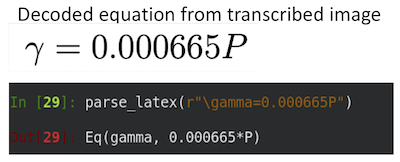

## Equation Detection and Parsing

Models are often represented concisely as equations, at a level of abstraction that can supplement both the natural language description as well as the source code implementation. Accordingly, the AutoMATES team is implementing a module for automatically reading equations found in scientific papers. This section details the approaches for (_a_) data acquisition, (_b_) detecting the location of equations, (_c_) encoding the image of the equation and then decoding it into a formal representation, and (_d_) converting the formal representation into an executable form that can be used in Program Analysis. Here we discuss current progress as well as planned next steps. To make rapid progress, the team has extensively explored available state-of-the-art (SOA) open-source tools and resources, and so additionally we discuss the limitations of these tools as well as our plans for addressing these limitations.

All code for the Equation Reading pipeine is implemented within the AutoMATES
[equation_extraction](https://github.com/ml4ai/automates/tree/master/equation_extraction) repository directory. There is additionally a [section below](#Instructions-for-running-components) devoted to explaining the steps needed to run each component of the architecture.

### Architecture

**Figure 12**: The overall architecture for equation detection and reading.

Figure 12 shows the Equation Detection and Reading architecture. Blue-stripe-filled boxes indicate SOA open source components that are currently used. These components currently run stand-alone and are not yet integrated into an end-to-end pipeline, but will soon. The grey-label lines between the SOA components indicate the representation that is to be passed between them. In the following sections we describe the discovered limitations of these third-party components for our use case and our plans for replacing/extending each.

### Data collection

We constructed several datasets in order to train and evaluate the neural machine learning components used in the detection and decoding of equations found in text.

For this work, the team is making use of papers written in LaTeX (TeX), downloaded in bulk from [arXiv](https://arxiv.org), an open-access preprint database for scientific publications. The team has downloaded the complete set of arXiv PDFs and their corresponding source files from Amazon S3 (as described [here](https://arxiv.org/help/bulk_data_s3)). Similar datasets have been constructed previously, but they are very limited in scope. For example, a sample of source files from the `hep-th` (theoretical high-energy physics) section of arXiv was collected in 2003 for the [KDD cup competition](https://www.cs.cornell.edu/projects/kddcup/datasets.html) (see [equation decoding section](#equation-decoding) for examples of the consequence of this limited scope). By downloading the full set of arXiv, the team has extended this dataset to both increase the number of training examples and to include a variety of AutoMATES-relevant domains (including agriculture, biology, and computer science).

#### Dataset preprocessing pipeline

The team has put together a preprocessing pipeline with the purpose of preparing the downloaded arXiv data for use in equation detection and decoding.

First, the paper source files are organized in a directory structure that can be processed efficiently. Then, for each paper, the TeX file that has the `\documentclass` directive is selected as the main
TeX file (see [here](https://arxiv.org/help/faq/mistakes#wrongtex) for more information). Once a main TeX file has been selected, the TeX source is tokenized using [plasTeX](https://github.com/tiarno/plastex) and the content of certain environments are collected together with the environment itself (e.g., the tokens inside the `\begin{equation}` and `\end{equation}` directives, together with the label `equation`). User-defined macros are expanded using code developed by the team to normalize the input to the neural decoder.

Based on an analysis of 1600 arXiv papers, the most commonly used math environments (in order) are: `equation`, `align`, and `\[ \]`. While the Prototype currently only handles the `equation` environment (40% of the equations found), the pipeline will be extended to accomodate the other two types in the future.

The extracted code for each equation is rendered into a standalone equation image. The paired standalone image and source tokens form the training data for the [equation decoder](#equation-decoding). Additionally, the PDF file for the entire paper is scanned for the standalone equation image using [template matching](https://docs.opencv.org/4.0.0/df/dfb/group__imgproc__object.html). The resulting axis-aligned bounding box (AABB) is stored for the subsequent training of an [equation detector](#equation-detection).

While much of the preprocessing pipeline is complete, there are a few remaining elements that need to be implemented. The planned work includes additional normalization of the extracted TeX tokens to provide the equation decoder a more consistent input. At minimum, the this will include the removal of superfluous code such as`\label{}` directives, the normalization of certain LaTeX expressions
(e.g., arbitrary ordering of super- and sub-script annotations in equations), and the [augmentation of the rendered standalone equations](#Equation-decoding).

### Equation detection

Before equations can be decoded, they first need to be located within the scientific papers encoded as PDF files. For this, the team evaluated standard machine vision techniques. The SOA [Mask-RCNN](https://github.com/matterport/Mask_RCNN) (He et al., 2017) was selected both for its robust performance across several detection tasks as well as its ease of use. Here, as the desired output of the model is the page and AABB of the detected equations, we ignore the mask (i.e., the precise set of pixels which compose the object), and as such the model is essentially an easy to use Faster R-CNN (Ren et al., 2015).

The Faster R-CNN model uses a base network consisting of a series of convolutional and pooling layers as feature extractors for subsequent steps. This network is typically a [ResNet](https://arxiv.org/abs/1512.03385) backbone trained over [ImageNet](http://www.image-net.org/) or [COCO](http://cocodataset.org).

Next, a region proposal network (RPN) uses the features found in the previous step to propose a predefined number of bounding boxes that may contain equations. For this purpose, fixed bounding boxes of different sizes are placed throughout the image. Then the RPN predicts two values: the probability that the bounding box contains an object of interest, and a correction to the bounding box to make it better fit the object.

At this point, the Faster R-CNN uses a second step to classify the type of object, using a traditional R-CNN. Since there is only one type of object of interest (equations), the output of the RPN can be used directly, simplifying training and speeding up inference. However, one potential disadvantage of only having a single label is that the model could be confused by similar page components (e.g., section titles and tables). Since we have access to the TeX source code, in the future we can include these other objects and their labels and will train the model to differentiate between them explicitly.

Currently, the team has been able to train the Mask-RCNN on the equation images and AABBs from a subset of the arXiv data.

### Equation decoding

Once detected, the rendered equations need to be automatically converted into LaTeX code. For this task we employ a variant of an [encoder-decoder architecture](https://machinelearningmastery.com/encoder-decoder-recurrent-neural-network-models-neural-machine-translation/) that encodes the equation image into a dense embedding and then decodes it into LaTeX code capable of being compiled back into an image. LaTeX was selected as the intermediate representation between input image and the eventual target executable model of the equation because of the availability of a large amoutn of training data ([arXiv](https://arxiv.org/)) and because LaTeX preserves both typographic information about how equations are rendered (e.g., bolding, italics, subscript, etc.) while also preserving the components of the notation that will be used for the successful interpretation of the equation semantics.

Encoder-decoder architectures have been successfully applied to image caption generation (e.g., Vinyals et al., 2017), a task that is similar to our task of mapping equation images to equation code. In order to make rapid progress, we began with an existing SOA model previously trained for the purpose of converting images to markup (Deng et al., 2017). The model was trained with the [2003 KDD cup competition](http://www.cs.cornell.edu/projects/kddcup/datasets.html), which itself consists of a subset of arXiv physics papers.

We evaluated the pre-trained Deng et al. model for our use case by taking a sample of 20 domain-relevant equations from a scientific paper describing the ASCE evapotranspiration model (Walter et al., 2000) (which is also implemented in [DSSAT](https://github.com/DSSAT) and has been made available for analysis in the Prototype [CodeExplorer webapp](#codeexplorer)). 

Based on this, we have learned that the Deng et al. model is sensitive to the source image equation font as well as the size of the image. For this reason, we present here the results of performance of the model based on two versions of the source equation images, as we have learned important lessons by considering both.

For the first version of the equation images, we attempted to create a version of the equations that matches as closely as possible the equation font and rendered image size as was used in the origina training data used by Deng et al. This was done by manually transcribing the equations into a LaTeX that generates stylistically close equation renderings. We refer to this as the _transcribed_ version of the equations.

For the second version of the equation images, we modeled how we expect to get the equations from the equation extraction pipeline. Here, the equation image was constructed by taking a screenshot of the equation from the original source paper, and then cropping the image to the size of the AABB returned from the [equation detection](#equation-detection) process described above. We found that in this case, the pre-trained Deng et al. model was unable to successfully process these images until they were rescaled to 50% of their original size. After rescaling, we then ran the images through the Deng et al. pipeline. We refer to these images as the _cropped_ version of the equations.

When comparing the results of the model on the _transcribed_ and _cropped_ equation images, we found several patterns.

First, there are several cases in which the pre-trained model is able to completely correctly decode the _transcribed_ image (12 out of 20, or 60% of the images). This correct decoding accuracy drops to 5% when using the _cropped_ images (strictly speaking, it is 0%, but on one image the only mistake is superficial). The proportion of character-level mistakes (e.g., wrong characters or incorrect super/sub-script, etc.) also increases from 2.7% to 31.2% when comparing the results of the _transcribed_ and _cropped_ images (numbers reflect only images which are renderable). This highlights the brittleness of the pre-trained model: when used on images that do not conform to the conditions of the original training data used by Deng et al., the model is unable to produce usable results. 

We also found that when the model is given the _cropped_ images, because of the font difference the model over-predicts characters as being in a bold typeface. While this difference is minor for general text, bold typeface is semantically meaningful in mathematical notation as it signals that the variable is likely a vector rather than a scalar. 

We also observed that in multiple cases, a 'J' in the original equation was decoded it as a $$\Psi$$, as shown in the comparsion in Figure 13.

**Figure 13**: Incorrect decoding of 'J' as '$$\Psi$$'.

A likely explanation for the confusion between 'J' and '$$\Psi$$' is that the Deng et al. model was pre-trained on a subset of arXiv that contains only articles on particle physics. In this domain, there is a [specific subatomic particle that is referred to as J/$$\Psi$$](https://en.m.wikipedia.org/wiki/J/psi_meson). The model is likely over-fitted to the specific domain it was trained on.

To address these issues, our next steps will use the following strategies:

1. First, we will retrain the model using a much larger portion of arXiv. This
represents a much wider set of equation styles (from different disciplines) and has orders of magnitude more data. We anticipate that this will help address the issue of overfitting. 

2. Second, in order to make the model more robust to differences in image size, font, typesetting, etc., we will augment the training data by taking the source latex and rendering the equations under different conditions, such as keepin the same base equation but changing the font, image size, rotating, adding blurring, etc. This kind of data augmentation is a standard technique for improving model generalization in machine vision systems (e.g., Baird, 1993; Wong et al., 2016; Wang & Perez, 2017, _inter alia_). 

3. And third, we will use methods for post-processing the sequent-to-sequence decoder output. This will address several kinds of errors that appear to be a result of the unconstrained nature of the sequence decoder. Decoder errors are manifested in several ways. In some cases, the pre-trained model generates a sequence of tokens which cannot be compiled in LaTeX (10% of the _transcribed_ images and 35% of the _cropped_ images). For example, the generated LaTeX cannot be compiled because the decoder produced a left bracket without producing the corresponding right bracket. This mismatch may occur even when the generated LaTeX _can_ be compiled, as in the example in Figure 14, where an open brace is generated followed by a close parenthesis.

	

	**Figure 14**: Example with mistmatched brace and parenthesis.

	Another example of decoding that may benefit from post-processing is when multiple mentions of a single variable in an equation are decoded differently, as shown in Figure 15.

	

	**Figure 15**: Multiple variable mentions with inconsistent decoding.

	In the left-most example (a) of Fig 15, the problem is minor, as the wrongly decoded variable is where the equation is being _stored_. In the right-most equation (b), the semantics of the formula are completely lost when 'T' is incorrectly decoded as '$$\Gamma$$'. In both cases, the problem will be exacerbated when converting the equations to executable code and especially when the extracted information needs to be assembled for model analysis.

	To address decoding errors like these, the team will explore methods for enforcing syntactic constraints on the decoded sequence. For example, one solution is to shift from making local decoding decisions to finding the global best decoding for the image. Currently, at a given point in the sequence during decoding, the decision about what token should be produced next is made by greedily choosing the output token with the highest likelihood, given the input encoding and the previously decoded tokens. Instead, when the decisions are made to find the best _global_ sequence, then the model is unlikely to produce certain token combinations that never occured in training (e.g., a left bracket without a matching right bracket). We will explore several strategies, including using a conditional random field layer on top of the decoder as well as using the Viterbi algorithm with domain-specific constraints. Additionally, a grammar can be used with the decoder (as was done by Krishnamurthy et al. (2017) for generating well-formed logical forms for use in querying a knowledge base) to ensure valid LaTeX is generated.

### Conversion to executable representation

The final stage in the pipeline is the conversion of the equation to an executable representation. We chose to use [SymPy](https://www.sympy.org) for two reasons. First, and primarily, SymPy provides a symbolic representation of the equation so that while it is executable, variables can remain unassigned. Second, the Program and Model Analysis uses python as the intermediate language. There is an available open-source library called [latex2sympy](https://github.com/augustt198/latex2sympy) (which has been [experimentally incorporated into sympy](https://docs.sympy.org/latest/modules/parsing.html#experimental-latex-parsing)) for converting LaTeX expressions into SymPy expressions. The conversion makes use of a manually crafted [antlr4](https://www.antlr.org/) grammar.

After some small post-processing (e.g., removing spaces introduced between characters in the generated LaTeX), we found that simple expressions were correctly converted, such as in Figure 16:

**Figure 17**: Example of LaTeX to SymPy conversion.

However, more complex equations may not be handled due to additional LaTeX font specification and specialized grouping symbols, as demonstrated in Figure 18. Removing these additional annotations improves equation SymPy conversion.

**Figure 18**: Improving SymPy conversion by removing additional LaTeX notation.

That said, even after taking these steps, it is clear that we will need to extend the antlr4 grammar in order to handle the decided equations. In particular, we need to inform the splitting of characters into distinct variables (e.g., subscripts such as _max_ should not be considered as three variables multiplied together, _eo_ should not be considered as an exponential if we have previously seen it defined as a variable, etc.). Also, equations that contain other equations need to be represented with function calls, rather than multipication (e.g., _eo(T)_ is a reference to an equation so needs to be interpreted as a single symbol, but latex2sympy converts it as `e**o*(T)`). Moving forward, our strategy is to expand the latex2sympy grammar and also consider expanding the plasTeX library that we are using for LaTeX tokenizing LaTeX (which will improve LaTeX code handling, such as spacing, etc.).

### Instructions for running components

We have separate README files for the individual components of the equation reading pipeline:

- [Downloading and processing arXiv](https://github.com/ml4ai/automates/blob/m5_phase1_report/documentation/deliverable_reports/m5_final_phase1_report/readmes/README_arxiv.md)
- [Detecting equations in a pdf](https://github.com/ml4ai/automates/blob/m5_phase1_report/documentation/deliverable_reports/m5_final_phase1_report/readmes/README_equation_detection.md)
- [Decoding equation images into LaTeX](https://github.com/ml4ai/automates/blob/m5_phase1_report/documentation/deliverable_reports/m5_final_phase1_report/readmes/README_equation_decoding.md) (requires gpu)

### Updates

Since the last report, progress has been made in the following four areas, with many of the details described in the sections above.

- **Data collection**:

  - Since the last report, the team [added LaTeX macro expansion](https://github.com/ml4ai/automates/blob/master/equation_extraction/latex.py), accomplished through a recursively applied lookup table. This allows for the normalization of tokens for training the equation decoder.
  - The team also incorporated template rescaling to better match the rendered equation against the original PDF image. This resulted in significantly more accurate axis-aligned bounding boxes.

- **Equation detection**:

  - The team installed the current SOA [Mask-RCNN](https://github.com/matterport/Mask_RCNN) model, processed the training data to fit the required model format, and evaluated the model with our corpus.

- **Equation decoding**:

  - The team succesfully reproduced equation decoding results from Deng et al. (2017) paper using their pre-trained model and the provided evaluation data. We have additionally successfully run the training procedure with a small toy dataset. We are in the process of reimplementing the model to allow for greater control of the inputs, architecture, and computation resource requirements (CPU in additional to GPU) to address the limitations found in the original Deng et al. implementation.

- **Conversion to executable representation**:

  - The team has chosen a library for converting the generated LaTeX to SymPy and evaluated the output. Based on the our evaluation, the team is working on expanding the antlr4 grammar and also looking into extending the plasTeX library.
