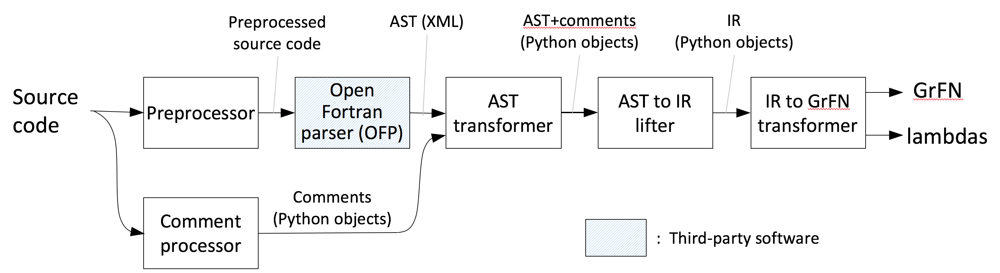

## Program Analysis: for2py

The core functionality of `for2py` consists of extracting the syntactic structure of the input code (Fotran) in the form of an _abstract syntax tree_ (AST), which is then written out in a form suitable for subsequent analyses, eventually producing a GrFN representation and associated lambda representations of component functions. Idiosyncracies of the Fortran language make it non-trivial and time-consuming to construct a Fortran parser from scratch; also most available Fortran parsers are part of compilers and closely integrated with them, making the extraction of the AST difficult. The only suitable Fortran parser we have found, and which we use in `for2py`, is the open-source tool [Open Fortran Parser](https://github.com/OpenFortranProject/open-fortran-parser), `OFP`. While its functionality as a Fortran parser fits our needs, `OFP` suffers from some shortcomings, e.g., an inability to handle some legacy constructs and handling a few other constructs in unexpected ways, that require additional effort to work around.

### Architecture

The architecture of the `for2py` Fortran-to-GrFN translator is shown in Figure 8. It is organized as a pipeline that reads in the Fortran source code, transforms it through a succession of intermediate representations, as described below, and writes out the GrFN representation of the code along with associated Python code ("lambdas").

**Figure 8:** for2py architecture

The processing of the input source code proceeds as follows:

- **Preprocessing:** This step processes the input file to work around some legacy Fortran features (Fortran-77) that `OFP` has trouble handling, e.g., continuation lines and comments in certain contexts.
- **Comment processing:** Like most other programming language parsers, `OFP` discards comments. Since comments play a vital role in AutoMATES, we use a separate processing step to extract comments from the input code for later processing. For comments associated with particular lines of code, we add special marker statements into the source code that force `OFP` to identify them and embedded in the AST. This allows us to subsequently associate the extracted comments with the corresponding points in the code.
- **AST Extraction:** This step uses the `OFP` Fortran parser to extract an AST of the input program in XML form.
- **AST transformation:** This step takes the AST obtained from `OFP` and simplifies it by removing irrelevant Fortran-specific details. It then combines the resulting data structure with the comments extracted from the program so that comments can be correlated with the appropriate program points. The result is written out as a pickled Python data structure.
- **AST to IR lifter:** The simplified AST resulting from the previous step is then lifted into `for2py`'s internal representation (IR). As an intermediate step of this process, `for2py` generates a Python program that is behaviorally equivalent to the input code and which can be used to validate the translation.
- **GrFN generation:** The IR constructed in the previous step is mapped to the GrFN specification of the input code together with associated Python functions ("lambdas")

### Instructions for running components

Many of the components in the pipeline described above can be run as stand-alone programs as described below.

- **Preprocessing:**
  `python preprocessor.py` _in\_file_ _out\_file_

- **Comment processing:**
  `python get_comments.py` _src\_file_

- **OFP parser:**
  `java fortran.ofp.FrontEnd --class fortran.ofp.XMLPrinter --verbosity 0` _src\_file_ `>` _ast\_file_

- **AST transformation:**
  `python translate.py -f` _ast_file_ `-g` _pickle_file_ `-i` _src_file_

- **AST to IR lifter:**
  `python pyTranslate.py -f` _pickle_file_ `-g` _py_file_ `-o` _out_file_

- **GrFN generation:**
  `python genPGM.py -f` _py_file_ `-p` _grfn.json_ `-l` _lambdas.py_ `-o` _out_file_

### Updates

Our implementation effort since the last report has focused on the following:

1. **Modules.** At the time of our previous report, we were able to read in Fortran modules into the `for2py` IR. Since then we have focused on translating this IR into the corresponding GrFN representation. This led to a reexamination and generalization of the treatment of scopes and namespaces in GrFN, now represented [within GrFN using `<identifiers>`](GrFN_specification_v0.1.m5). We have now incorporated this generalization into the translation of module constructs in `for2py`.
2. **Derived types.** These are the Fortran equivalent of `struct`s in the C programming language; `for2py` translates these into Python [`dataclasses`](https://docs.python.org/3/library/dataclasses.html) . The translation of derived types is complicated by `OFP`'s handling of this construct. We are currently working on (_a_) refactoring and cleaning up our initial code to handle derived types to make it easier to extend, debug, and maintain; and (_b_) extending the implementation to handle nested derived types. This work is in-progress.
3. **Comment handling.** We have extended our handling of comments to include both function-level and intra-function comments. This necessitated developing a way to insert semantics-preserving markers into the ASTs generated by `OFP` and associating each such marker with the corresponding intra-function comment. This strategy has been implemented.
4. **Testing and debugging.** We have been working on testing and debugging the end-to-end translation pipeline to improve its usability and robustness.
