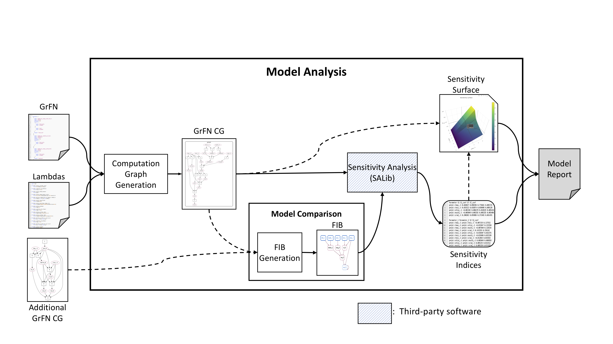

## Model Analysis

Similar to program analysis, the model analysis module can be viewed as a pipeline. The inputs to this pipeline are the outputs from the program analysis, text reading, and equation parsing pipelines. The program analysis module provides a wiring specification and a set of associated lambda functions for the GrFN computation graph. Together these fully describe the structure of a scientific model found in source code. The output from text reading and equation parsing are combined in the GrFN specification in order to ground the variables used in computation. This information is critical for the model comparison phase. The model analysis module utilizes all of these inputs, as well as similar sets of inputs for other scientific models to generate a model report, the end unit of the model analysis pipeline. The model report contains all information recovered during model analysis about the sensitivity of the model to various inputs over various ranges and, if requested, information about comparative model fitness to other models of the same output. While the individual components of a model report exist in our model analysis module the format of the actual report is still being determined.

### Architecture

The architecture for the model analysis module is presented below. The overall structure of the module is a pipeline that transforms extracted information from text, equations, and software into a report about a scientific model. However, this pipeline has optional additional components (represented by dashed input arrows) that can be included in the final model report based upon the amount of information desired by the user. In this section we will describe the intermediate objects created during model analysis as well as the algorithms used during their generation.

**Figure 19:** Model Analysis pipeline

#### Computation graph generation
Generating an actual computation graph from a GrFN spec and lambdas requires two phases, a wiring phase and a planning phase. The output from these two phases will be an executable computation graph.
- **Wiring phase**: This phases utilizes the container representation of scopes in the GrFN specification to wire together the functions and variables of a GrFN into a computation graph that has a set of input and output variables. While wiring a given scope, a set of input variables is maintained for the scope, as well as a set of live variables. This allows the function nodes to receive the proper variable inputs and is used for passing live variables as inputs into a contained scope for further wiring. The output of this phase is a fully wired computation graph with both variable and function nodes. A variable node includes a reference to a storage location to store the value of the variable during computation, and a function node stores both a reference to the lambda function represented by the node and a list specifying an ordering on the variable inputs to the function node.
- **Planning phase**: In this phase, a partial order is imposed over the lambda functions in the call graph of the GrFN, to determine an efficient order of computation and discover sets functions that can potentially be executed in parallel. The ordering is recovered using `HeapSort` on the function nodes in the computation graph, where the heap invariant is the distance from the function node to an output node. The output of this algorithm is a call stack that can be used to execute the `GrFN` computation graph. After this phase is completed the computation graph can be executed as many times as needed without requiring a graph traversal per computation, allowing for more efficient sampling and sensitivity analysis.

An example of the `GrFN` computation graph for `PETASCE` (the ASCE Evapotranspiration model) is shown below.

**Figure 20:**: ASCE Model GrFN computation graph

This view exposes the wiring of all variable nodes and function nodes to form an executable graph. The function nodes are represented by a single-letter code denoting the type of function computed - see the [Function Network](#function-network) section for their meanings.

#### Model comparison
After the generation of the computation graph, it is possible to compare one computation graph to another.
In order to compare two models, we first identify the overlap in their variable nodes. Currently, this is done using string matching, since we are comparing two models from DSSAT, and the variables have standardized names in the code, but in the future, we expect to rely on variable grounding using information recovered from text reading and equation parsing.
This allows us to match variable nodes between computation graphs. Once we have done this, we construct subgraphs from each of the computation graphs based upon the graphs formed by the shared variable nodes between the two graphs.
After creating these new subgraphs we must add any additional variable nodes that are needed to compute the functions contained in the subgraph. These additional nodes form what we term the _cover set_ of variable nodes.
We find these nodes with the following algorithm:

- For each function node _f_ in the subgraph $$G_s$$:
  - For each variable node _v_ that is an input to _f_:
    - If _v_ is not included in $$G_s$$:
      - Add _v_ to $$G_s$$.

As a final check, we look to see if any variable nodes in the cover set are assigned values by a literal function node. We remove these variable nodes from the cover set, and add them and their literal assignment function node directly to the subgraph. The combination of shared variable input nodes, cover set variable nodes, and additional wiring forms a `Forward Influence Blanket` or `FIB` for short. An example of the `FIB` for the `PETASCE` model is shown below. Here we can see the shared input variables colored in blue, while the cover set variables are colored green.

**Figure 21:** ASCE Model GrFN Forward Influence Blanket

We can then run sensitivity analysis on the individual `FIB`s to discover how the shared input variables affect the uncertainty in the shared model outputs. We propose this as one criterion for model selection.

#### Sensitivity analysis and model reporting

For sensitivity analysis, we utilize the `SALib` python package to both sample from our input spaces and compute output sensitivity over an input space.
We have created a simple API that takes a `GrFN` computation graph along with a set of search bounds for all model inputs and then returns the sensitivity indices properly associated with each input or pairs of inputs.

The sensitivity indices that are returned from a call to the sensitivity analysis API can then be used to determine what information about a model is worth including in the model report.
For a report about a single model we will likely be interested in which variables or which pairs of variables contribute the most and least to output uncertainty, as quantified using the sensitivity indices.
Once we have recovered the indices we can plot the output variable as a function of the input (or pair of inputs) that contributes the most to the uncertainty in the output variable.

For a report that compares the fitness of multiple models we can create sensitivity surfaces for each of the models for the pairs of inputs that cause the highest degree of uncertainty for each individual model. This allows us to quickly view the differences between models of the uncertainty caused by their input variables. This will allow us to quickly determine whether one model has an absolute advantage over the others for a given input range, and where any comparative advantages may exists between models for certain pairs of inputs.

### Instructions for running components

The model analysis pipeline has been fully wired into the `CodeExplorer` web application. Users can visualize the outputs from model analysis by loading one of our Fortran programs and inspecting the `GrFN Computation Graph` along with its associated `Function Call Graph` and `Causal Analysis Graph`. In addition, for the `PETPT` (Priestley-Taylor) model, users can visualize the sensitivity surface generated by the `S2` index of highest degree. This information is viewed on the sensitivity surface tab.

This functionality can also be programmatically accessed using the [`S2_surface`](https://ml4ai.github.io/delphi/delphi.GrFN.html#delphi.GrFN.networks.GroundedFunctionNetwork.S2_surface) method of the [GroundedFunctionNetwork](https://ml4ai.github.io/delphi/delphi.GrFN.html#delphi.GrFN.networks.GroundedFunctionNetwork) class.

### Current caveats

Currently we are using the `PETPT` and `PETASCE` modules for the evaluation of our model analysis module. This comes with certain advantages and obstacles that should be discussed.

One advantage of these modules is that variables that represent the same real-world object have the exact same names. This has enabled us to conduct model comparison experiments on these models without needing variable grounding information from the text reading module. In future iterations our model comparison component will utilize information provided by text reading in order to ground variables in our computation graphs.

One obstacle we needed to overcome in order create an executable computation graph for the `PETASCE` model was the identification of proper variable bounds. The `PETASCE` model includes calls to several functions that have restricted domains, such as `log` and `acos`. Unfortunately the `PETASCE` model contains no protections for inputs that are out-of-domain for these functions, thus domains for each input variable must be discovered via analysis. We are currently developing a component of the model analysis module that will handle the discovery of input domain verification. For now our `GrFN` computation graph is able to recognize and handle failures in computation gracefully and alert our sampling component upon failure.

A related obstacle to the above is that `PETASCE` contains a string variable that is used for control flow. Its usage requires that the string be one if two possible inputs, either `W` or `A`. Failure to provide one of those values as the input for this variable causes the `PETASCE` model to reach undefined behavior with no preventative safety measures. For our current iteration we have added preventative measures to the Fortran code. Future iterations of the model analysis module will automatically discover these complex constraints and determine their possible domains.

### Updates
- **End-to-end generation**: Our previous results from model analysis were based on running analysis methods over translated Python programs from original Fortran source code or hand-constructed `CAG`s for model comparison. We are now able to conduct all the steps of model analysis on the output format generated via the program analysis team.
- **Vectorized model evaluation**: We have begun experimenting with vectorizing the execution of our graph using the `PyTorch` tensor computation framework that can leverage GPU resources to speed up sampling.
This evaluation requires a few changes to the GrFN specification and generated lambda functions. Early experiments show that vectorization using PyTorch increases sampling speed by a factor of $$\sim 10^3$$ (when GPU resources are utilized, this increases to $$\sim 10^6$$).
- **Additional SA methods**: Due to the computational cost of `Sobol` sensitivity analysis, we decided to add two new methods of sensitivity analysis - the `FAST` and `RBD-FAST` sensitivity analysis methods - to our suite of analysis tools.
While these methods can only be used for computing first-order sensitivity indices,
their compute time scales constantly with number of samples (for comparison, Sobol analysis scales linearly). This can be seen in the figure below, generated by running all of our sensitivity methods on the `PETPT` model.

**Figure 22**: Sensitivity analysis compute times.
