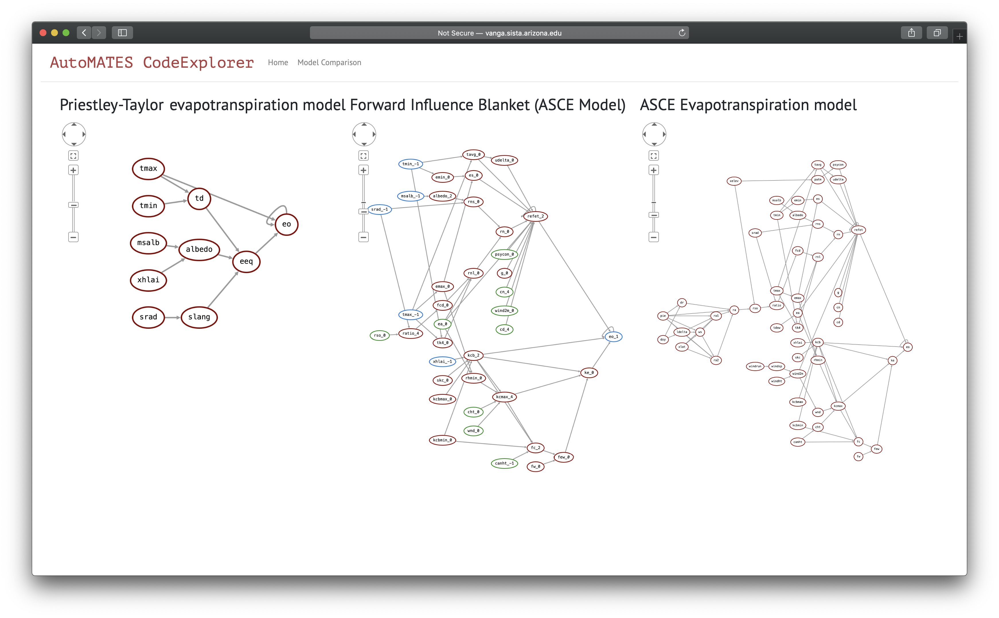

## CodeExplorer

The UA team has significantly extended the functionality of the original AutoMATES demo webapp to create the AutoMATES CodeExplorer, the main HMI for the AutoMATES Prototype. This section describes how to access an already running instance of the webapp, as well as run it locally, followed by a description of the CodeExplorer features.

### Instructions for running

The webapp has currently been tested in [Safari](https://www.apple.com/safari/) and [Chrome](https://www.google.com/chrome/) browsers; while it may run in other browsers, behavior is not guaranteed (it is known that some functionality breaks in [Firefox](https://www.mozilla.org/firefox/)). We note below an additional known issue with the web interface.

#### Accessing the webapp online

The easiest way to try out CodeExplorer, without having to install it and run locally, is by visiting the version deployed at [http://vanga.sista.arizona.edu/automates/](http://vanga.sista.arizona.edu/automates/). This has all of the same functionality in the current code release.

#### Running the webapp locally

To run the webapp locally instead, you will need to install Delphi. For *nix systems, assuming you have the prerequisites (Python 3.6+ and graphviz), you can install Delphi with the following commands:


```
git clone https://github.com/ml4ai/delphi
cd delphi
pip install .
```

To get the tag associated with the code release for this milestone, do the
following after cloning the repo and `cd`-ing into the `delphi` directory:

```
git fetch && git fetch --tags
git checkout 4.0.0-alpha
```

This will also install a command line hook to launch the CodeExplorer app, so you can just execute the following from the command-line

```
codex
```

and navigate to [http://127.0.0.1:5000/](http://127.0.0.1:5000/) in your browser to view the app.

The CodeExplorer webapp is built using [Flask](http://flask.pocoo.org). All code and data used for the CodeExplorer can be found in the [Delphi Github repository](https://github.com/ml4ai/delphi)


### CodeExplorer Features

The CodeExplorer has two main interfaces: 

- The 'Home' page is for 'live' **Code Analysis**.
- The [**Model Comparison**](#model-comparison) page provides a more 'curated' experience demonstrating the comparison of models extracted from two code sources.

Links to either interface are located adjacent to the CodeExplorer title bar (as shown in Figure 1).


**Figure 1:** Screenshot of AutoMATES CodeExplorer interface

Figure 1 shows a screenshot of the Code Analysis ("Home") interface. As with the Month 3 demo, Fortran source code is input in the pane to the left and submitted for analysis. The CodeExplorer now provides three source files through the `Choose Model` button:

- Crop Yield: A toy program that demonstrates basic Fortran code idioms (main, subroutine, loops, conditionals)
- Priestly-Taylor model of Evapotranspiration (DSSAT): This is the unaltered Pristly-Taylor model as found in the [DSSAT Github repository](https://github.com/DSSAT).
- ASCE model of Evapotranspiration (DSSAT): This contains the complete functionality of the ASCE model, but has been altered by combining content from several files into one in order to make the code base consiste of one file. This example demonstrates the inclusion of several Fortran modules.

Once one of these models is selected (or other Fortran is input), the user can click the `Submit` button to send the code for Program Analysis. The [Program Analysis module](/#program-analysis-for2py) is still under active development, and does not cover all Fortran features yet, so we encourage the user to try small modifications to one of the three example models provided, rather than trying arbitrary Fortran code.

#### Function Network

Once the source code has been analyzed, a graphical representation of the Grounded Function Network is displayed in the Function Network right pane (as in Figure 1). Oval-shaped nodes in the graph represent Variables, while the small squares represent Functions. Four kinds of functions are labeled:

- `L`: Literal value assignment (a variable is assigned a literal value; no inputs to these functions)
- `A`: Assignment function (assigns a variable value as a function of one or more other varaibles)
- `C`: Condition function (assigns a conditional variable based on the condition of a conditional statement)
- `D`: Decision function (assigns a variable to the value based on the outcome of a conditional)

Two types of colored **scope boxes** may appear around portions of the graph:

- Green boxes: represent "code containers", generally corresponding to source code program scope.
- Blue boxes: represent "loop plates", indicating the program scope that is iterated according to a loop. Everything within a loop plate (including other scope boxes) may be "iterated" in execution of the loop.

To see an example of both types of scope boxes, Submit the `Crop Yield` Fortran source code. Both of the other code examples only involve a single code container scope box. When the mouse hovers over a box, the upper-left will show a "minus" sign that can be clicked to collapse the box; mousing over a collapsed box will reveal a "plus" that can be clicked to expand the box.

All of the nodes in the graph can be selected (clicking) to toggles a views of the metadata associated with the node, as described in the following two subsections. (NOTE: once you select a node, it will stay selected, so you can view several node metadata at a time. However, if you change the view pane or collapse a scope box, the metadata views will remain open. This is a known issue that will be addressed in the future.)

##### Text Reading-derived variable metadata

Clicking on the variable nodes (maroon ovals) brings up
automatically-associated metadata and provenance for the variables extracted by [Text Reading](#) from (1) code comments and (2) scientific texts. Figure 2 shows examples of metadata from each of these sources.


**Figure 2:** Variable metadata from code comments and scientific text.

##### Function lambda code and equations

Clicking on the black square nodes, representing functions, brings up the generated Python lambda function and the equation it represents. Figure 3 shows examples of the equation and lambda function from two functions.


**Figure 3:** Function equation representation and lambda function.

#### Causal Analysis Graph

Clicking on the "Causal Analysis Graph" tab shows a simplified view of the model, in which the function nodes are elided, and the edges between the variable nodes denote causal influence relations. Clicking on the nodes brings up variable descriptions, similarly to the Function Network graph view.


**Figure 4:** Causal Analysis Graph view

(NOTE: although you can select Variable nodes, these do not currently populate their metadata; This is only currently possible in the Function Network graph pane.)

#### Equivalent Python Code

Clicking on the "Equivalen Python Code" tab displays the python code that was generated by Program Analysis and has the same functionality as the input Fortran code. This is helpful for debugging the Program Analysis process.

#### Sensitivity Surface

The "Sensitivity Surface" tab shows a surface plot of the output variable of the model with respect to the two input nodes that it is most sensitive to, as measured by the [$$S_2$$ (second order) Sobol sensitivity index](https://en.wikipedia.org/wiki/Variance-based_sensitivity_analysis). The creation of this surface requires knowing the bounds of the variables - right now we use a hard-coded dictionary of preset bounds for variables in the Priestley-Taylor model, but in the future we hope to automatically extract domain information for the variables using machine reading.


**Figure 5:** Sensitivity surface for pre-selected Priestly-Taylor model.

Currently, this tab only works for the Priestly-Taylor model. For the other two source code examples, the notice shown in Figure 6 is displayed below the `Submit` button.


**Figure 6:** Warning about missing bounds information.

### Model Comparison

The **Model Comparison** page provides a more 'curated' experience demonstrating the outcome of comparing two models extracted from two code sources, in this case the source code for the Priestly-Taylor and ASCE models from the main page. 

The "Model Comparison" page displays two models of potential evapotranspiration as implemented in DSSAT - the Priestley-Taylor and ASCE models - and the 'forward influence blanket', i.e. the 'intersection' of the models (shown below). The blue nodes in the graph indicate variables common to the two models.


**Figure 7:** The model 'intersection'


