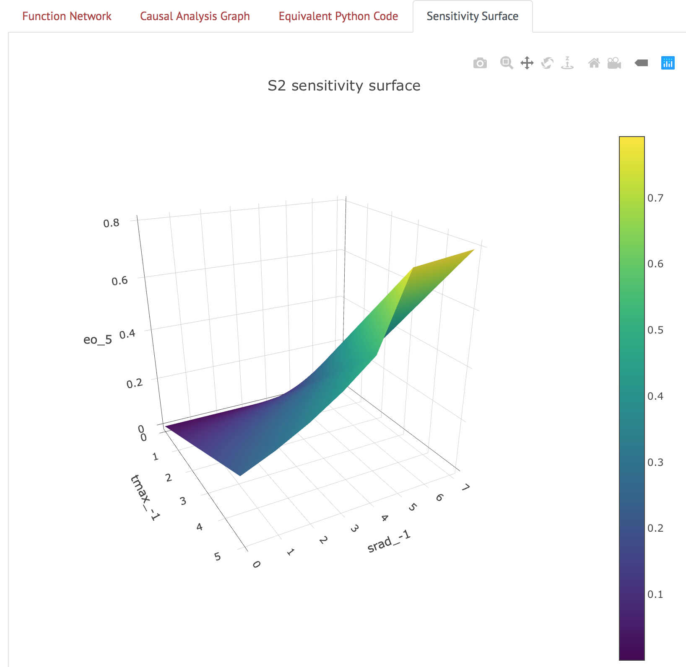

## Demo Webapp

### Architecture

The CodeExplorer webapp is built using [Flask](http://flask.pocoo.org). It has
two main sections - the home page is for 'live' experimentation, while the
'Model Comparison' page provides a more 'curated' experience, with fewer knobs
to play with.

The [program analysis module](/#program-analysis-for2py) is still under active
development, and does not cover all Fortran features yet, so we encourage the
user to try small modifications to one of the three example models provided,
rather than trying arbitrary Fortran code.

### Instructions for running

#### Accessing the webapp online

The quickest way to try out CodeExplorer, without having to install it, is by
visiting the version deployed at
[http://vanga.sista.arizona.edu/automates/](http://vanga.sista.arizona.edu/automates/).

#### Running the webapp locally

To run the webapp locally instead, you will need to install Delphi. For
*nix systems, assuming you have the prerequisite (Python 3.6+ and
graphviz), you can install Delphi with the following commands:

```
git clone https://github.com/ml4ai/delphi
cd delphi
pip install .
```

This will also install a command line hook to launch the CodeExplorer app, so
you can just do

```
codex
```

and navigate to [http://127.0.0.1:5000/](http://127.0.0.1:5000/) in your
browser to view the app.


### Updates

The UA team has made numerous improvements to the demo webapp (now christened
CodeExplorer). Below is a screenshot of the current iteration of the app,
showing a computational graph view of the Priestley-Taylor model of potential
evapotranspiration.


#### NLP Annotations

Clicking on the variable nodes (maroon ovals) brings up
automatically-associated metadata and provenance for the variables extracted
using NLP from code comments and scientific papers.


#### Lambda functions and equations

Clicking on the black square nodes brings up the generated Python lambda
function and the equation it represents.


#### Causal Analysis Graph

Clicking on the "Causal Analysis Graph" tab shows a simplified view of the
model, in which the function nodes are elided, and the edges between the
variable nodes denote causal influence relations. Clicking on the nodes brings
up variable descriptions, similarly to the computational graph view.


#### Sensitivity Surface

The "Sensitivity Surface" tab shows a surface plot of the output variable of
the model with respect to the two input nodes that it is most sensitive to, as
measured by the $$S_2$$ Sobol sensitivity index. Right now, the creation of
this surface depends on knowing the bounds of the variables - right now we use
a hard-coded dictionary of preset bounds for variables in the Priestley-Taylor
model, but in the future we hope to automatically extract domain information
for the variables using machine reading.



#### Model Comparison

The "Model Comparison" page displays two models of potential evapotranspiration
as implemented in DSSAT - the Priestley-Taylor and ASCE models - and the
'forward influence blanket', i.e. the 'intersection' of the models (shown
below). The blue nodes in the graph indicate variables common to the two
models.


