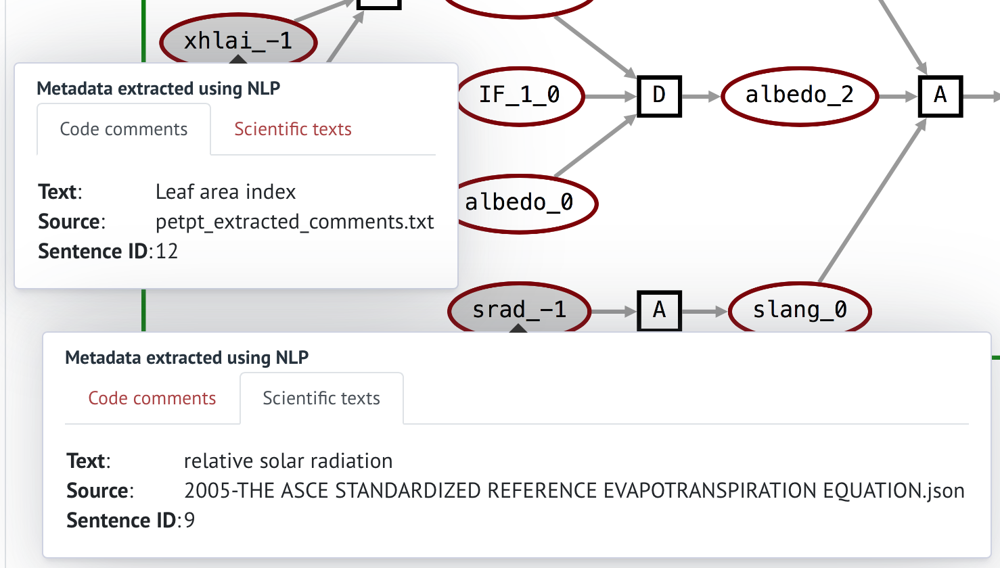
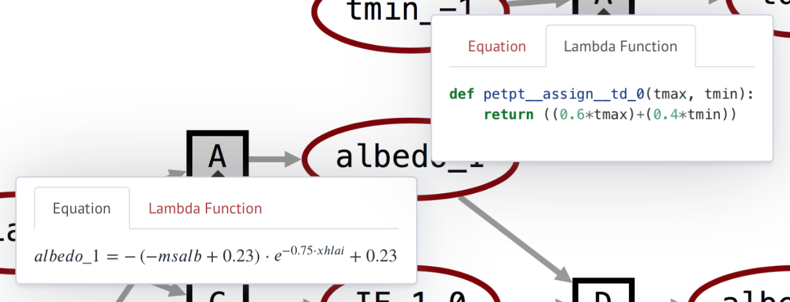
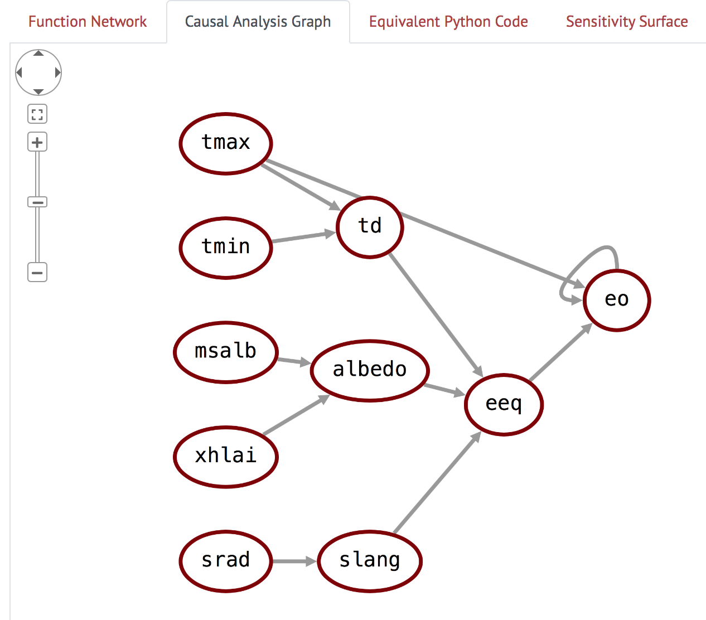

## CodeExplorer

The UA team has significantly extended the functionality of the original
AutoMATES demo webapp to create the AutoMATES CodeExplorer, the main HMI for
the AutoMATES Prototype. The CodeExplorer demonstrates a processing pipeline
that includes:

- Performing Program Analysis on input Fortran source code to produce an
 intermediate Grounded Function Network (GrFN) representation.
- Inspection of the [GrFN representation](#function-network).
- Summary of the GrFN as a [Causal Analysis Graph](#causal-analysis-graph).
- Inspection of the [functionally equivalent Python
 representation](#equivalent-python-code) generated by Program Analysis.
- An example of model [Sensitivity Analysis](#sensitivity-urface) (currently
 only for the Priestley-Taylor model, as described below).
- View of the results of [Model Comparison](#model-comparison).

This section describes how to access a remotely deployed instance of the
webapp, as well as run it locally, followed by a description of its features.

### Instructions for running

The webapp has currently been tested using the
[Safari](https://www.apple.com/safari/) and
[Chrome](https://www.google.com/chrome/) browsers. While it may run in other
browsers, behavior is not guaranteed (it is known that some functionality
breaks in [Firefox](https://www.mozilla.org/firefox/)). We note below an
additional known issue with the web interface.

#### Accessing the webapp online

The easiest way to try out CodeExplorer, without having to install it and run
locally, is by visiting the version deployed at
[http://vanga.sista.arizona.edu/automates/](http://vanga.sista.arizona.edu/automates/).
This has all of the same functionality in the current code release.

#### Running the webapp locally

To run the webapp locally instead, you will need to install Delphi. For *nix
systems, assuming you have the prerequisites (Python 3.6+, pip, and graphviz),
you can install Delphi with the following commands:


```
pip install https://github.com/ml4ai/delphi/archive/master.zip
```

If you want to get the tagged version corresponding to this milestone, you can
run the following command instead:

```
pip install git+https://github.com/ml4ai/delphi.git@4.0.1
```

(Note: to use the AnalysisGraph class to create and parameterize models from
text reading, you'll need to download the Delphi SQLite database and set the
`DELPHI_DB` environment variable as described
[here](https://ml4ai.github.io/delphi/installation.html#other-environment-variables).)
This will also install a command line hook to launch the CodeExplorer app, so
you can just execute the following from the command-line

```
codex
```

and navigate to [http://127.0.0.1:5000/](http://127.0.0.1:5000/) in your
browser to view the app.  The CodeExplorer webapp is built using
[Flask](http://flask.pocoo.org). All code and data used for the CodeExplorer
can be found in the [Delphi Github repository](https://github.com/ml4ai/delphi)


### CodeExplorer Features

The CodeExplorer has two main interfaces: 

- The 'Home' page is for 'live' **Code Analysis**.
- The [**Model Comparison**](#model-comparison) page provides a more 'curated'
 experience demonstrating the comparison of models extracted from two code
 sources.

Links to either interface are located adjacent to the CodeExplorer title bar
(as shown in Figure 1).


**Figure 1:** Screenshot of AutoMATES CodeExplorer interface

Figure 1 shows a screenshot of the Code Analysis ('Home') interface. As with
the Month 3 demo, Fortran source code is input in the pane to the left and
submitted for analysis. The CodeExplorer now provides three source files
through the `Choose Model` button:

- Crop Yield: A toy program that demonstrates basic Fortran code idioms (main,
 subroutine, loops, conditionals)
- Priestley-Taylor model of Evapotranspiration (DSSAT): This is the unaltered
 Priestley-Taylor model as found in the [DSSAT Github
 repository](https://github.com/DSSAT).
- ASCE model of Evapotranspiration (DSSAT): This contains the complete
 functionality of the ASCE model, but has been altered by combining content
 from several files into one in order to make a single-file program.

Once one of these models is selected (or other Fortran is input), the user can
click the `Submit` button to send the code for Program Analysis. The [Program
Analysis module](/#program-analysis-for2py) is still under active development,
and does not cover all Fortran features yet, so we encourage the user to try
small modifications to one of the three example models provided, rather than
trying arbitrary Fortran code.

#### Function Network

Once the source code has been analyzed, a graphical representation of the
Grounded Function Network is displayed in the Function Network pane to the
right of the editor (as in Figure 1). Oval-shaped nodes in the graph represent
Variables, while the small squares represent Functions. Four kinds of functions
are labeled:

- `L`: Literal value assignment (a variable is assigned a literal value; no
 inputs to these functions)
- `A`: Assignment function (assigns a variable value as a function of one or
 more other variables)
- `C`: Condition function (assigns a conditional variable based on the
 condition of a conditional statement)
- `D`: Decision function (assigns a variable to the value based on the outcome
 of a conditional)

Two types of colored **scope boxes** may appear around portions of the graph:

- Green boxes represent "code containers", generally corresponding to source
 code program scope.
- Blue boxes represent "loop plates", indicating the program scope that is
 iterated according to a loop. Everything within a loop plate (including other
 scope boxes) may be "iterated" in execution of the loop.

To see an example of both types of scope boxes, submit the `Crop Yield` Fortran
source code. Both of the other code examples only involve a single code
container scope box. When the mouse hovers over a box, the upper-left will show
a "-" sign that can be clicked to collapse the box; mousing over a collapsed
box will reveal a "+" that can be clicked to expand the box.

All of the nodes in the graph can be selected (by clicking) to toggle a view of
the metadata associated with the node, as described in the following two
subsections. (NOTE: once you select a node, it will stay selected, so you can
view the metadata for several nodes at a time. However, if you change the view
pane or collapse a scope box, the metadata views will remain open. This is a
known issue that will be addressed in the future.)

##### Text Reading-derived variable metadata

Clicking on the variable nodes (maroon ovals) brings up
automatically-associated metadata and provenance for the variables extracted by
[Text Reading](#text-reading) from (1) code comments and (2) scientific texts. Figure 2
shows examples of metadata from each of these sources.



**Figure 2:** Variable metadata from code comments and scientific text.

##### Function lambda code and equations

Clicking on a function node brings up the automatically generated Python
lambda function and the equation it represents. Figure 3 shows examples of the
equation and lambda function from two functions.



**Figure 3:** Function equation representation and lambda function.

#### Causal Analysis Graph

Clicking on the "Causal Analysis Graph" tab shows a simplified view of the
model, in which the function nodes are elided, and the edges between the
variable nodes denote causal influence relations. Clicking on the nodes brings
up variable descriptions, similarly to the Function Network graph view.



**Figure 4:** Causal Analysis Graph view

(NOTE: although you can select Variable nodes, these do not currently populate
their metadata; This is only currently possible in the Function Network graph
pane.)

#### Equivalent Python Code

Clicking on the "Equivalent Python Code" tab displays the python code that was
generated by Program Analysis and has the same functionality as the input
Fortran code. This is helpful for debugging the Program Analysis pipeline.

#### Sensitivity Surface

The "Sensitivity Surface" tab shows a surface plot of the output variable of
the model with respect to the two input nodes that it is most sensitive to, as
measured by the [$$S_2$$ (second order) Sobol sensitivity
index](https://en.wikipedia.org/wiki/Variance-based_sensitivity_analysis). The
creation of this surface requires knowing the bounds of the variables - right
now, we use a hard-coded dictionary of preset bounds for variables in the
Priestley-Taylor model, but in the future we hope to automatically extract
domain information for the variables using machine reading.


**Figure 5:** Sensitivity surface for pre-selected Priestley-Taylor model.

Currently, this tab only works for the Priestley-Taylor model. For the other
two source code examples, the notice shown in Figure 6 is displayed below the
`Submit` button.


**Figure 6:** Warning about missing bounds information.

### Model Comparison

The **Model Comparison** page provides a more 'curated' experience
demonstrating the outcome of comparing two models extracted from two code
sources, in this case the source code for the Priestley-Taylor and ASCE models
from the main page. As shown in Figure 7, the Causal Analysis Graphs for the
Priestley-Taylor and ASCE models are displayed in the left and right columns,
respectively. 


**Figure 7:** The model 'intersection'

In the middle column is a representation of the subset of the ASCE model
is contained in the 'Forward Influence Blanket' (covered in the [model
analysis](#model-analysis) section) identified by the nodes shared
between Priestley-Taylor and ASCE. The blue nodes indicate the variables shared
between the models, and the green nodes the variables in ASCE that do not
appear in Priestley-Taylor but are direct parents of any nodes along a path
between the blue nodes; these are the ASCE variables that directly affect any
functions between the overlapping variables. 
