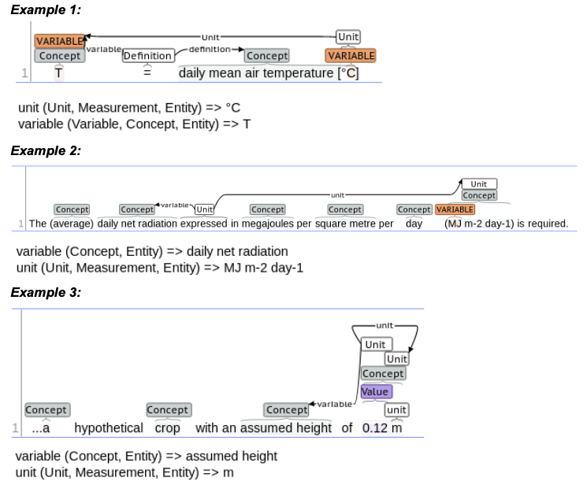

## Text Reading

The team has been working on improving the quality of the extraction of variable units from text and comments.

### Extracting units from text:

**Figure 1**: Example of units in text.

Extracting units from scientific text (see examples above) is a multi-step process. First, a number of basic units are extracted with a lexicon-based entity finder; the lexicon has been recently updated to exclude a number of basic units that resulted in false positives due to their similarity to variables. Second, composite (i.e., multi-token) units as well as units which are not in the lexicon, are extracted using rules. False positives are eliminated by applying a set of heuristic constraints (e.g., number of tokens in the candidate unit, length of each token in the candidate unit, presence of digits, etc.). Finally, units are attached to the relevant previously-found variables (ex. 1) and concepts (exs. 2-3) with rules.  Frequently, units occur in sentences that do not include the relevant variable, with units attaching to the variable definitions/concepts. To address this issue, the team will start working on resolving these definitions/concepts to the relevant variables in the surrounding text.

**Figure 1**: Example of units in comment.

With comments being less varied than text, extracting units from comments happens in only two stages: extracting units with a rule and attaching the unit to the previously found variable with another rule (see example above).
