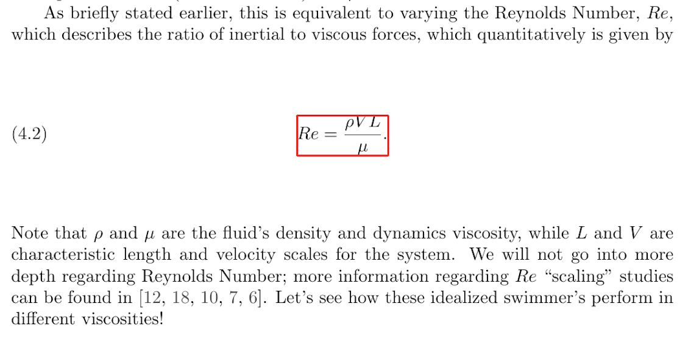

## 3. Machine Reading and Grounding

In addition to extracting information from source code, the AutoMATES
team will be automatically extracting complementary scientific
information from academic papers, including the description of
model-relevant equations and the variables that comprise them, along with
the information required for the sensitivity analysis of the models of
interest in this project.  Once extracted, this information will be
grounded, or linked, to the model components extracted in `TODO`.

### Automatic reading of scientific discourse expressed in natural language

The scientific papers that describe the models of interest will be read
to extract three different types of information: (1) contextual
information relevant to the models of interest, (2) specific
descriptions of equations and variables, and (3) relations pertinent to
these equations and variables.

#### Extracting context

There is a wide range of contextual information expressed in scientific
descriptions of models, including ranges and units for variables,
confidence scores such as p-values, and overall context required for
analysis of the executable models. In order to extract this
information, the papers, which are typically found in PDF form, will
need to be converted to text. The team will evaluate several
off-the-shelf tools for this conversion and select the one that performs
the best for the intended purpose. Potential tools include (but are not
necessarily limited to): [GROBID](https://github.com/kermitt2/grobid),
[Science Parse](https://github.com/allenai/science-parse), and [Science
Parse version 2](https://github.com/allenai/spv2).

As the PDF-to-text conversion process is always noisy, the text will
then be filtered to remove excessively noisy text (e.g., poorly
converted tables) using common sense heuristics (e.g., sentence length
and occurrence of certain special characters). As a final step in
preprocessing, the text will be [syntactically parsed](https://github.com/clulab/processors). 

After preprocessing, the contextual information will be extracted
through the use of
[Odin](http://www.lrec-conf.org/proceedings/lrec2016/pdf/32_Paper.pdf)
rule grammars, which can be constructed and refined quickly.  Odin
grammars have proven to be reliable, robust, and efficient for diverse
reading at scale in both the Big Mechanism (with the
[Reach](https://academic.oup.com/database/article/2018/1/bay098/5107029)
system) and the World Modelers programs (with the
[Eidos](https://github.com/clulab/eidos/) system).

#### Extracting equation and variable descriptions

In addition to contextual information, the team will also focus on
extracting the descriptions of model-relevant equations and their
variables found in the scientific literature which typically occur in
the immediate vicinity of the presentation of the equations themselves.
However, during the conversion from PDF to text, information about the
original _location_ of a given span of text is lost. For this reason, in
order to extract these descriptions, the team will first implement a
component that identifies the regions of interest in the academic
documents.

Specifically, using the [bounding box found for a given equation](#equation-detection),
the team will expand it to get the text surrounding the
equation.  Additionally, the pdf can be converted to text in
layout-preserving mode (using [Poppler's
pdf2text](https://poppler.freedesktop.org/)), which will allow the team
to locate the equation identifier and therefore the the text around it.

, as well as the extraction of entities and relations required
for the grounding the models built by other components of our system.

This component is divided in two submodules: (A) in charge of the acquisition of
information such as ranges and units for variables, confidence scores such as
p-values, and overall context required for the automatic execution of our
executable models. And (B), the identification of sections of the document that
describe equations and variables, as well as the extraction of the relevant
descriptions from those sections of text.

This includes the extraction of text from PDF files, optionally preserving the
document layout information. It also involves the development of grammars
designed for the automatic extraction of the information of interest. It is
important for this component to comunicate with other steps in the equation
extraction pipeline for the acquisition of axis aligned bounding boxes (AABB)
that will be required for the identification of the relevant sections of text,
as well as the equations themselves and the variables that compose them.

### Grounding and linking

There are serveral aspects of grounding in this approach.  The first involves
linking the variables that are found in the source code with the corresponding
comments, for example: `TODO example from the fortran`

The second type of linking is similar, linking the variables and equations found
in the scientific papers with their descriptions.  This is seen in the following
example of an equation and its description: 

Here, each of the variables in the equation (e.g., `L` and `V`) will be linked
the their extracted descriptions (`characteristic length` and `velocity
scales`).  Additionally the entire equation will be linked to its description
(`Reynolds Number`).  Any other instances of these variables or equations in the
text document will also be linked.

Finally, the extracted information from each of the sources (code and text) will
be grounded, or linked, by generating a mapping from equation variable to code
variable using their attached descriptions to inform the alignment process.
