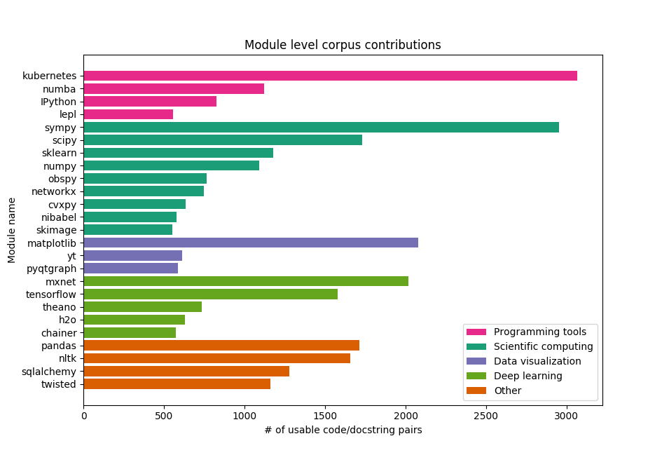

### Encoder/decoder generation results
Our experiments with an encoder/decoder model showed that our model was not able to acquire enough signal to adequately generate docstring summarizations for source code. Our results indicated that the model was failing to learn from the data. We decided on the three following tasks that would help increase our models ability to learn from data and allow us to debug what portions of the model may be failing. The first task is to reassess the code/docstring corpus to see if there were unnecessary sources of error in the corpus and to attempt to gather more data. The second task is to reassess the code/docstring embeddings by observing the vocabulary size and determining whether lowering the vocabulary size is possible, and whether it would aid the generation model. The third task is to create a model for a simpler task (classification) that has the same form as the model for our generation task that we can use to assess whether their is enough signal for the generation model to be able to generate docstring summarizations given our dataset. In the following three sections we will outline the progress we have made on these three tasks.

### Progress on code/docstring corpus
The team was able to increase the size of our overall code/docstring corpus by indexing more python packages to look for additional python functions that had PEP-style descriptive docstrings. We were able to index additional python packages from the following lists of packages: the [anaconda distribution](https://docs.anaconda.com/anaconda/packages/py3.6_osx-64/), the [awesome-python](https://github.com/vinta/awesome-python) list, and the list of all available [SciKit packages](http://scikits.appspot.com/scikits). In total we increased the amount of python packages that we are searching for code/docstring pairs to add to our corpus from only 24 to 1132. However, the amount of data we discovered from these packages has only increased from roughly 22,000 examples to roughly 82,000 examples. This suggests that the variance in functionality of code samples included in our dataset has greatly increased. We have added the following graphic to give a preview of the styles of code-bases that have added the largest amount of code/docstring pairs to our corpus.

**Figure 1:** Graphical view of the amount of usable code/docstring pairs each python module has added to our code-summarization corpus (only the 25 modules with the largest amount of usable pairs are shown).
 

### Progress on code embeddings
One of the biggest struggles for any embedding is to ensure that enough examples are present for every token you wish to embed. Without a large number of examples the embedding space cannot create meaningful embeddings for corresponding tokens. In the case of creating embeddings for code, it is likely the case that the names of functions are going to be some of the most important tokens to embed, and unfortunately also the most infrequent if the names are kept as a single token. From our original dataset of 22,000 examples we had roughly 53,000 unique tokens in the code portion of our corpus. The vast majority of these were function or variable names that occurred fewer than five times each, not nearly enough to be able to establish useful embeddings that capture the type of semantic information carried in function or variable names.

We decided to remedy this problem by splitting function and variable names into sub-components using `snake_case` and `camelCase` rules. In order to preserve name semantics we added unique identifiers `<BoN>` and `<EoN>` that specify the beginning and end of function/variable names. Some examples of the tokenized forms of function names found in our corpus before and after the transformation are provided in the following table.

|Original tokenization  | Split-name tokenization |
| --- | --- |
| `compute_ldap_message_size`  | `<BoN> compute ldap message size <EoN>`  |
| `getComponentByPosition`  | `<BoN> get Component By Position <EoN>`  |
| `fromOpenSSLCipherString`  | `<BoN> from Open SSL Cipher String <EoN>`  |
| `fromISO8601`  | `<BoN> from ISO 8601 <EoN>`  |

Splitting function/variable lowered our code vocabulary size from roughly 53,000 to roughly 16,000 unique tokens. It also lowered the amount of tokens that appear fewer than five times from roughly 35,000 to roughly 5,000. This will give our code embeddings and incredible boost in semantic power that will be useful for docstring generation.

### Docstring classification task
One of the difficulties with generation tasks is being able to tell whether your model has enough signal from the data to be able to generate affectively. In order to evaluate whether our dataset provides enough signal for our generation task we have created a separate classification task that will allow us to tell if our model has enough signal from the input code/docstring pairs to be able to tell if a docstring describes the code it has been paired with. Our choice of classification task is to pair a code-block from our corpus with a docstring and have our classifier determine if this pairing is accurate (i.e. does the provided docstring correctly document the provided code-block?). In the following sections we will describe the current baseline model we are using for classification, present the two classification datasets we are using, present some preliminary classification results, and discuss the next steps for our classification task research.

##### Baseline neural model description
Our initial classification model is a simplification from the model we originally planned to use for generation. We constructed a model that first embeds a code sequence using our pretrained code embeddings and embeds a docstring using our pretrained docstring embeddings. The two embedded sequences are each fed into their own respective [Bi-LSTM recurrent network](https://pdfs.semanticscholar.org/4b80/89bc9b49f84de43acc2eb8900035f7d492b2.pdf). The final hidden state outputs from these networks are concatenated and fed into a deep feed-forward neural network that produces a binary classification of whether the docstring is correctly paired with the provided function.

Our rationale for simplifying the model used for classification is that we are currently simply testing to see if our data is providing enough signal to aid in classification. Once we verify that we do have enough signal to allow for decent classification results we will increase the models complexity. It is important to note that since the main purpose of the classification model is to test the fitness of our data for generation we cannot add any docstring-specific information to the classification model, since such information would not be present during docstring generation.

##### Random-draw and challenge dataset description

##### Initial classification results
We have run our baseline model on our random-draw dataset that was generated by our original corpus (22,000 pairs). After processing over our training set for 35 epochs our dev accuracy of 80%, a figure that we are very excited about!

##### Next steps
Now that we have increased our corpus size and created our challenge dataset, our immediate next task is to re-run our baseline model on both the random-draw dataset and challenge dataset to see how the changes to our code/docstring corpus affect our performance on our two datasets.

Pending encouraging results on the above experiments, we will then begin increasing the complexity of our model by adding character embeddings for the code/docstring tokens. We also plan to add attention layers to the LSTM output from the code and docstring LSTMs that add attention on the alternate sequence respectively. If the results from the above experiments are not as good as we hoped then we will also investigate adding more docstring data to our docstring embeddings from large online documenation repositories such as [ReadtheDocs](https://readthedocs.org/) to improve the signal from our docstring sequences.
