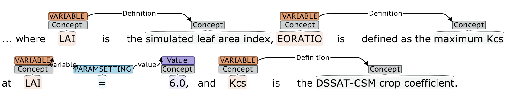

# Text Reading

## Converting pdf to text

Discussed in the previous report, the first task required to perform
automated text reading and information extraction was the conversion of
the source documents from pdf to text.  Several tools were evaluated on
the specific types of documents that are used here (i.e., scientific
papers) and at the end the team chose to use [science
parse](https://github.com/allenai/science-parse) for both its quick
processing of texts as well as the fact that it handles section
divisions and greek letters well.  The team integrated science parse
with their pipeline via a docker container such that it can be run
offline (as a preprocessing step) or online during the extraction.

## Extracting quantities

The team is also utilzing another open-source tool,
[grobid-quantities](https://github.com/kermitt2/grobid-quantities),
which can find and normalize quantities and their units, and even detect
the type of the quantities, e.g., _mass_.  The tool finds both single
quantities and intervals, with differing degrees of accuracy.  The
grobid-quantities server is run through docker and the autoMATES
extraction system converts the extractions into mentions for use in
later rules (i.e., the team's extraction rules can look for a previously
found quantity and attach it to a variable).  While grobid-quantities
has allowed the team to begin extracting model information more quickly,
there are limitations to the tool (i.e., unreliable handling of unicode
and inconsitent intervals).  The team has opened several issues on the
github page for grobid-quanities and will continue to do so.  If
nesessary, the extraction of quantities may be moved into the odin
grammars for full control.

## Rule-based extraction framework

In terms of extraction, the team has begin a light-weight information
extraction framework for use in the aske program.  The system
incorporates elements of [eidos](https://github.com/clulab/eidos) (e.g.,
the webapp for visualizing extractions, entity finders based on syntax
and the results of grobid-quantities, and the expansion of entities that
participate in relevant events) along with new
[odin](http://clulab.cs.arizona.edu/papers/lrec2016-odin.pdf) grammars
for identifying, quantifying, and defining variables as shown here: 

This project is fully open-source and has already been utilized and
contributed to by the Georgia Tech aske team.

To promote rapid grammar development, the team has developed a framework
for writing unit tests to assess the extraction coverage.  This will
allow for quickly increasing rule coverage while ensuring that previous
results are maintained.  Currently, there are 39 tests written, of which
15 pass.

## Next Steps

The immediate next steps for machine reading are to expand the coverage
of the rules for natural language text and then to begin extracting
information about variables from source code comments.  The team will
then create an end-to-end alignment tool to map variables found in code
to the corresponding variable described in natural language.  

