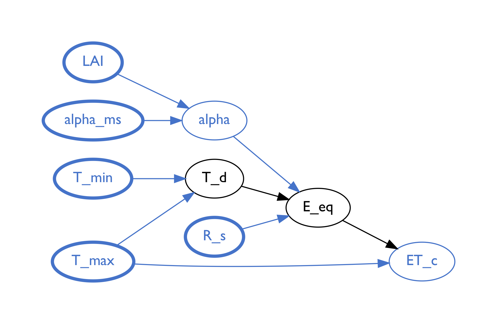

## Model Analysis

### Automated function network comparison

A key goal of model analysis is to enable comparison of models that describe the underlying target domain. When the models overlap, they share some variables, but likely not others. The first task in comparing GrFN function networks is to identify where the models overlap.

During this phase, the team developed an algorithm to identify the shared portion of
two function networks. As a working example, we show what the algorithm identifies as the overlapping subnetworks of two evapotranspiration models in the DSSAT system: ASCE and Priestley-Taylor.
The following two figures show a graphical representation of the shared portions of these two models, which are identified by a network property that we refer to as a _Forward Influence Blanket_ (FIB). In the following section we will formally define the structure of a FIB and its role in model analysis.

---

**Figure 1:** Representation of the subnetwork within the Priestley-Taylor model identified by the Forward Influence Blanket that intersects with the ASCE model.
 

---

**Figure 2:** Representation of the subnetwork within the ASCE model identified by the Forward Influence Blanket that intersects with the Priestley-Taylor model.
 

---

### Identifying the Forward Influence Blanket (FIB)

Drawing a loose analogy to a [Markov Blanket](https://en.wikipedia.org/wiki/Markov_blanket), a _Forward Influence Blanket_ identifies the variables that are shared between two function networks, along with the non-shared variables that are involved in any functional relationships that are along the directed paths between the shared variables. The FIB gets its name because we are analyzing the _influence_ that variables have on one another in a directed (_forward_ from input to output) network, and the _blanket_ identifies minimal subset of such influences shared between the two networks.

The two figures above depict the portions of the function networks for the two models identifies as overlapping, by identifying the FIB. The nodes in the graphs represent variables, the directed arcs indicate a directed functional relationships (variable at the tail is an input, the variable at the head is the output variable that is a function of the input), and the nodes are color-coded to provide a visual depiction of different relationships with respect to the FIB. Consider the second figure, depicting the ASCE function network. All the blue nodes in the network represent variables that are also found int he Priestly-Taylor model. The blue nodes with thicker lines represent variables that play \"input\" roles in both of the overlapping subnetworks: they are shared and do not have any parents that are also in the subnetworks.

Next, between the blue nodes, along the directed paths from the \"inputs\" to the output nodes are black nodes that represent variables that are not shared between the two models, and therefore represent intermediate values that may represent differences in the functional relationships between the inputs and outputs of the subnetwork. (Determining what the functional differences may be is the subject of the next phase, sensitivity analysis, described in the next section.)

In the first figure, depicting the Priestley-Taylor function network, all of the black nodes are between blue nodes. In fact, there are no other nodes or edges that are not colored blue and black. This means the inputs and outputs of the Priestley-Taylor network are \"contained within\" the ASCE network while there are some differences in the computation between the inputs and outputs (the black nodes).

In the ASCE network, however, there are a number of additional nodes. The green colored nodes depict the variables that have directed influence on the computations along the paths from inputs to outputs, although they are _not_ shared between the networks. If one is interested in directly comparing the subnetworks to each other, the states of the green variables may affect the input-to-output relationships.

Finally, the orange nodes represent all of the variables in the ASCE model that are not shared by the Priestley-Taylor model, and cannot directly affect the functional relationships between the shared inputs and outputs without either first passing through a blue or green node. It is in this sense that the green and blue nodes together form the **blanket** that isolates the functional relationships between the inputs and outputs that are shared between the two networks.

Having identified the FIB, with the blue and green nodes constitutes all of the inputs that can eventually affect the output(s), we can now turn to analyze the functional relationship between inputs and outputs, including the sensitivity of outputs to changes in the inputs.

### Sensitivity index discovery

In our previous report we demonstrated the ability to automatically
conduct sensitivity analysis on the inputs to the source code of an
extract models function network. The method we presented involved three
steps to fully conduct a sensitivity analysis of a given function *f*:

1. Take *N* samples from the input space of *f* using Saltelli sampling
2. Evaluate each of the *N* samples on *f* to form the set *E*
3. Perform Sobol analysis on *E*
4. Recover the $$S_1$$, $$S_2$$, and $$S_T$$ sensitivity indices

This method has been successful in retrieving all the information we
needed in order to determine which inputs account for the most
uncertainty in model output. Since our last report we began
experimenting to see how the runtime of sensitivity analysis is affected
by varying the sample size *N* or the size of the input space of
function *f*. Below we show graphs that depict runtime as a function of
the two previously mentioned variables. For each of these graphs the red
line shows the runtime for the entirety of sensitivity analysis and the
blue line shows the runtime of part (3) of the analysis as we vary the
variable under inspection.

##### Runtime as a function of sample size

As our models become more complex we expect that we will need to
increase the number of samples taken and evaluated in order to achieve a
similar amount of accuracy in sensitivity index estimation during
sensitivity analysis. Because of this, we determined that we needed to
empirically inspect the runtime of sensitivity analysis as the number of
samples increases. From the graph below, we can see that the increase in
runtime as the number of samples increases is roughly linear, both for
the entirety of sensitivity analysis and for the Sobol portion of
sensitivity analysis. This result is encouraging because it ensures that
as long as we maintain only a linear increase in the number of samples
required to conduct sensitivity analysis on our larger models then we
should not see a runtime increase that would render sensitivity analysis
unusable.

 

**Figure 3:** Visual depiction of increase in runtime for our Sobol
analysis method given an increase in sample size. The blue line depicts
the increase in runtime for the Sobol algorithm and the red line depicts
the runtime for the total program.
 

##### Runtime as a function of input space size

The models we plan on extracting from the DSSAT library will likely have
a very large number of inputs. This entails that the size of our input space
will be much larger than in the examples we have studied thus far.
Therefore, we determined that we needed to empirically observe the
affects of increasing the input space size (via increasing the number of
model inputs) on the runtime of sensitivity analysis. From the graph
below, we can see that as we linearly increase the amount of inputs to a
model, the runtime for the Sobol portion of sensitivity analysis
increases greater than linearly. We also notice that this increase in
runtime for the Sobol portion explains the greater than linear increase
in runtime for the entirety of sensitivity analysis. This result is
discouraging as our models of interest are likely going to have a large
number of inputs (for example the ASCE evapotranspiration model has 12
inputs). In order to handle larger models we are planning on
investigating methods of computing sensitivity analysis on subnetworks
of the models that have fewer inputs. This was a key motivation for the
development of Forward Influence Blankets as mentioned earlier in the
report that will allow us to study sensitivity analysis only on the
shared components of two large competing models of the same phenomena.
  
**Figure 4:** Visual depiction of increase in runtime for our Sobol
analysis method given an increase in number of inputs for the function
under analysis. The blue line depicts the increase in runtime for the
Sobol algorithm and the red line depicts the runtime for the total
program.
 

##### Sensitivity index stability

After reviewing the runtime requirements of sensitivity analysis, the
next question our team desired to answer was: how many samples are
necessary for the estimated sensitivity indices to be stable? To
visualize this we experimented with the PLANT model by varying the
number of samples supplied to our sensitivity analysis metric and
recording the S1 indices for the two inputs with highest sensitivity.
From our results it seems that the amount of samples needed to reach
stability of the S1 indices is much higher than the amount needed to
determine the ordering of which variables contribute the most
uncertainty to model output. As we will discuss in the following section
one of our plans for the next iteration of model analysis is to
implement efficient sampling methods that can allow our estimates of the
sensitivity indices to converge with far fewer samples.

 

**Figure 4:** Visual depiction of changes in stability of S1 sensitivity
indices with respect to increases in sample size from Saltelli sampling.
The model under evaluation for this test was the PLANT model from
the SimpleModular crop model.
 

### Next steps

##### Sensitivity index propagation

We anticipate that users of AutoMATES will likely want a visual
understanding of how uncertainty is being propagated through our
extracted function networks that represent their models of interest. In
order to accommodate this desire we plan on adapting our sensitivity
index discovery methods to be done on piecewise subnetworks of our
function networks (and FIBs) in a recursive style. This would mean that we
would only consider the immediate parents of a node when running
sensitivity analysis of that particular node. Afterwards we would
conduct sensitivity analysis on each of the parent nodes to determine
the sensitivity indices for each of the parent nodes' parents. Doing this
will allow us to see how sensitivity propagates from the input nodes to
output of any model under study at the finest granularity possible given
our modeling structure.

##### Bayesian sampling for Sensitivity Analysis

Given the results we have presented on in the increase in runtime for
our Sobol algorithm with respect to an increase in sample size and an
increase in the number of inputs, we have decided to investigate
measures to increase the effectiveness of our sampling methods. Although
runtime only increases linearly with an increase in the number of
samples, the amount of samples needed as the number of inputs increases
will increase exponentially due to [the curse of
dimensionality](https://en.wikipedia.org/wiki/Curse_of_dimensionality).
In order to combat this affect and keep our number of necessary samples
to a minimum we are investigating sampling methods via [Bayesian
Optimization](https://en.wikipedia.org/wiki/Bayesian_optimization) that
will allow us to sample our larger search spaces efficiently by taking
into account prior information about the models discovered during text
reading, equation detection, and program analysis.
