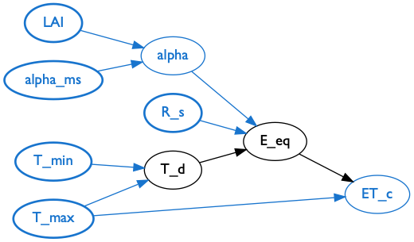
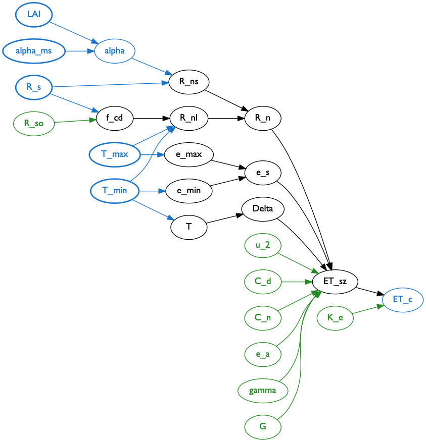

### Automated factor network comparison
As outlined in our previous report, structural comparison of two competing factor networks is a very important portion of model analysis. For two competing models (each represented by a factor network) that model the same phenomena we would like to generate comparative sensitivity reports about the shared inputs of the two models (i.e. inputs that both models have in common). In order to do this we first must determine the portions of the two models factor networks that overlap based upon shared inputs and shared outputs. Doing this allows us to compare the uncertainty of model output between two models as a function of the shared model inputs.

The team has accomplished the task of discovering the portion of two factor networks that is derived from shared inputs and outputs for the two evapo-transpiration models shown in our project proposal.

### Forward Influence Blanket (FIB) description

### Sensitivity index discovery

### Next steps
##### Sensitivity index propagation

##### Bayesian sampling for Sensitivity Analysis
