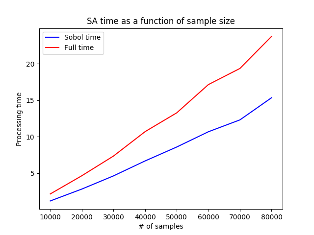
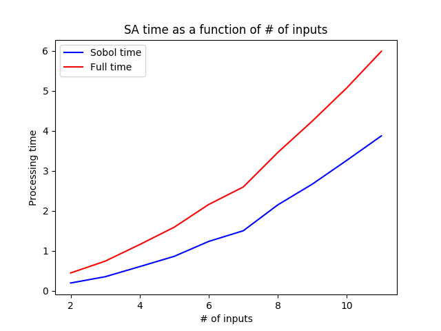

### Automated factor network comparison
As outlined in our previous report, structural comparison of two competing factor networks is a very important portion of model analysis. For two competing models (each represented by a factor network) that model the same phenomena we would like to generate comparative sensitivity reports about the shared inputs of the two models (i.e. inputs that both models have in common). In order to do this we first must determine the portions of the two models factor networks that overlap based upon shared inputs and shared outputs. Doing this allows us to compare the uncertainty of model output between two models as a function of the shared model inputs.

The team has accomplished the task of discovering the shared portion of two factor networks derived from the two evapotranspiration models shown in our project proposal. Below we show a graphical representation of the shared portions of these two models, which are represented by a new structure that we are referring to as Forward Influence Blankets (FIB). In the following section we will formally define the structure of a FIB and its use-case for model analysis.

<table class="image" align="center">
<caption align="bottom">Graphical view of the FIB for the Priestly-Taylor factor network.</caption>
<tr align="center"><td align="center"></td></tr>
</table>

<table class="image" align="center">
<caption align="bottom">Graphical view of the FIB for the ASCE factor network.</caption>
<tr><td></td></tr>
</table>

<!-- 

 -->
<!--

 -->

<!-- 

 -->
### Forward Influence Blanket (FIB) description
A common method for isolating a probabilistic subnetwork is to form a [Markov Blanket](https://en.wikipedia.org/wiki/Markov_blanket) around the subnetwork of interest. To form a full markov blanket, all of the parent nodes of the subnetwork of interest, as well as all the child nodes and parents of child nodes must be included, in order to fully isolate the probabilistic subnetwork. This is required in order to perform both forward and reverse inference on the subnetwork. However, for the purposes of model analysis we are currently only interested in questions pertaining to forward analysis (i.e. how do inputs to the model affect the output). Therefore we have created a loose variant of a markov blanket that we have named a Forward Influence Blanket (FIB). Our rationale for this naming is that a FIB is a _blanket_ around a probabilistic subnetwork that only captures the information necessary to determine the _influence_ that nodes have on each other in the _forward_ direction.

The two FIBs shown in the section above are color-coded to provide a visual depiction of the different components of a FIB. Let us consider the FIB for the shared subnetwork of the ASCE evapotranspiration model. We can see that some nodes are colored blue, and of those nodes some are bolded. All blue nodes in the network represent shared nodes that are also present in the Priestly-Taylor evapotranspiration model. The blue nodes that are bolded represent nodes that are shared inputs to both models (these are likely the nodes of highest interest to model analysis). Between the blue nodes in our FIB we have a series of one or more black nodes. These nodes are nodes that are found in the ASCE factor network but are not present in the Priestly-Taylor factor network. These nodes likely represent a difference in the computation used to derive the shared output from the shared inputs in these two models and they will likely be the cause of difference observed in model output uncertainty during analysis. We also observe nodes in the ASCE FIB that are colored green. These nodes are part of the blanket portion of the FIB that allow us to isolate the probabilistic subnetworks of the two models. We will need to observe values for these nodes as well when conducting uncertainty analysis.

### Sensitivity index discovery

<table class="image" align="center">
<caption align="bottom">Visual depiction of increase in runtime for our Sobol analysis method given an increase in sample size. The blue line depicts the increase in runtime for the Sobol algorithm and the red line depicts the runtime for the total program.</caption>
<tr><td></td></tr>
</table>

<table class="image" align="center">
<caption align="bottom">Visual depiction of increase in runtime for our Sobol analysis method given an increase in number of inputs for the function under analysis. The blue line depicts the increase in runtime for the Sobol algorithm and the red line depicts the runtime for the total program.</caption>
<tr><td></td></tr>
</table>

### Next steps
##### Sensitivity index propagation
We anticipate that users of AutoMATES will likely want a visual understanding of how uncertainty is being propagated through our extracted factor networks that represent their models of interest. In order to accommodate this desire we plan on adapting our sensitivity index discovery methods to be done on parent-child node pairs in our factor networks (and FIBs) in a recursive style.

##### Bayesian sampling for Sensitivity Analysis
Given the results we have presented on in the increase in runtime for our Sobol algorithm with respect to an increase in sample size and an increase in the number of inputs, we have decided to investigate measures to increase the effectiveness of our sampling methods. Although runtime only increases linearly with an increase in the number of samples, the amount of samples needed as the number of inputs increases will increase exponentially due to [the curse of dimensionality](https://en.wikipedia.org/wiki/Curse_of_dimensionality). In order to combat this affect and keep our number of necessary samples to a minimum we are investigating sampling methods via [Bayesian Optimization](https://en.wikipedia.org/wiki/Bayesian_optimization) that will allow us to sample our larger search spaces efficiently.
