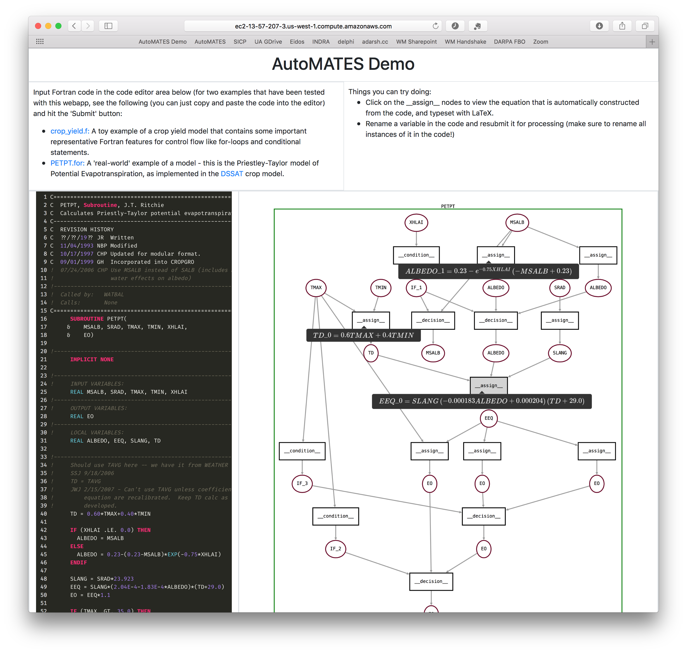

A demo of the current version of the prototype system is now live - you
can [try it out
here](http://ec2-13-57-207-3.us-west-1.compute.amazonaws.com)!

Currently, the demo has been only been tested with a limited number of
programs, so we encourage users as of now to experiment by modifying the
two suggested examples on the page, rather than trying to process
arbitrary Fortran programs. 

Clicking on the assign nodes yields a $$\LaTeX$$ representation of the
equation corresponding to the assign statement. This equation is
constructed using `SymPy`, and will facilitate the linkage to equations
extracted from papers using the equation parsing module.

For example - the screenshot above shows the analysis of the
Priestley-Taylor method of calculating potential evapotranspiration, as
implemented in DSSAT. A few of the `__assign__` functions have been
clicked, showing a few tooltips with black backgrounds containing some
of the equations involved in this calculation - these very equations can
be found on page 46 of the book [Understanding Options for Agricultural
Production](https://link-springer-com.ezproxy2.library.arizona.edu/book/10.1007%2F978-94-017-3624-4)
(reproduced below - the equations matching the ones in the screenshot of
thw webapp are highlighted with maroon borders).

---

